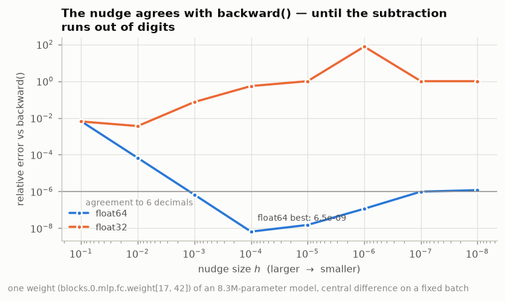
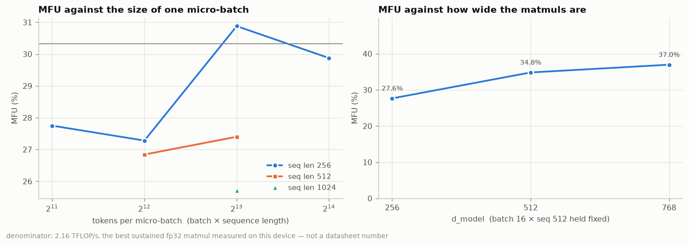
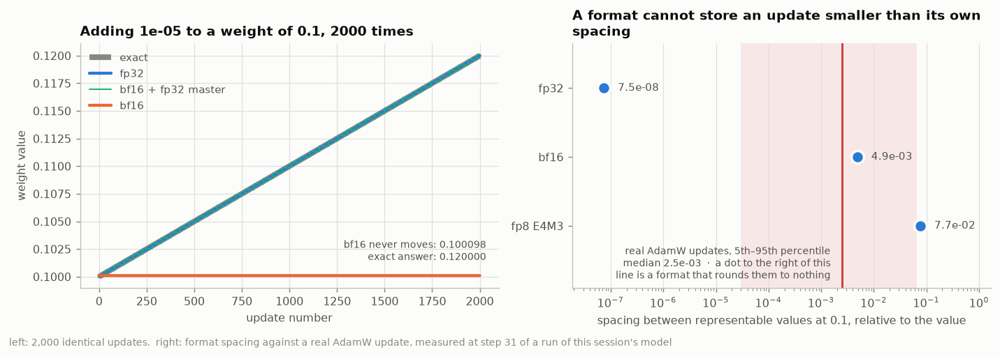

# The Training Loop, made to tell the truth about itself

**ERA V5 · Session 10 · The Training Loop**

A small transformer (8,336,384 parameters, 4 layers, d_model 256) and a real loop, instrumented
until every claim in it is a measured number rather than a quoted one. Six deliverables, each one
a script that runs on its own, writes its own JSON and its own write-up, and can be re-run from
scratch in a few minutes.

- **Repo:** https://github.com/amukka/ERA_V5/tree/main/session10_Training_Loop
- **Notebook:** [`session10.ipynb`](session10.ipynb) — all six, executed, with outputs
- **Evidence:** [`results/`](results/) — one `.md` (the write-up), one `.json` (every number), one
  `.png` (the figure) per deliverable
- **Machine:** Apple M4, torch 2.13.0, device `mps`. One machine, no distributed anything.

Every number below was produced by the code in this directory on that machine. Nothing is quoted
from the session notes without being recomputed first.

---

## The six deliverables

| # | Ask | Script | Headline |
|---|---|---|---|
| 1 | Print every tensor shape, say what each dimension means | [`experiments/e1_shapes.py`](experiments/e1_shapes.py) | 69 activations traced; every gradient has its weight's shape; **127.2 MiB** of training state for 8.3M weights |
| 2 | Verify one gradient by hand | [`experiments/e2_grad_check.py`](experiments/e2_grad_check.py) | nudge vs `backward()` agree to **10.6 decimals** in float64 — and to only **4.8** in float32 |
| 3 | Break gradient accumulation on purpose | [`experiments/e3_accumulation.py`](experiments/e3_accumulation.py) | printed loss wrong by **0.33%**, gradient wrong by **17.3%** and **8.4°** |
| 4 | Log the grad norm, find a step where it led the loss | [`experiments/e4_grad_norm.py`](experiments/e4_grad_norm.py) | step 345, unprompted: norm at 5.5σ, loss silent for **62 more steps** |
| 5 | Compute your own MFU, honestly | [`experiments/e5_mfu.py`](experiments/e5_mfu.py) | **30.3%** — and the denominator matters more than anything in the loop |
| 6 | Write 0.1 in fp32, bf16, fp8 E4M3 by hand | [`experiments/e6_float_bits.py`](experiments/e6_float_bits.py) | every hand-derived bit pattern matches hardware; **51.6%** of real updates vanish in bare bf16 |

---

## 1 · Every shape, and what each dimension means

→ [`results/e1_shapes.md`](results/e1_shapes.md)

Four tables: the 69 activation tensors from token ids to logits, the parameters, the gradients, and
the optimiser state. Each row carries a sentence naming what one index along each axis *selects* —
not `B×T×D` but "B=rows in the micro-batch, T=positions, D=d_model."

Two things fall out of printing it rather than reasoning about it:

- **Every gradient has the shape of its weight.** 8,336,384 gradient numbers for 8,336,384 weights,
  checked programmatically (`grad_shapes_match: true`), which is section 2's definition made
  literal: a gradient belongs to one weight.
- **The 16 bytes per weight are visible.** AdamW holds exactly two extra numbers per weight
  (16,672,768 for 8,336,384). Weight 2 B + gradient 2 B + fp32 master 4 B + two fp32 moments 8 B
  = 16 B, and for this model that is **127.2 MiB** before a single activation is stored.

The step's four micro-batches held **899, 940, 995 and 1,221 valid tokens** — different, because
the sequences are. That difference is the entire subject of deliverable 3.

---

## 2 · One gradient, verified by hand

→ [`results/e2_grad_check.md`](results/e2_grad_check.md) · 

Three parts. The session's own toy chain (`x=2, w1=3, w2=4, t=20`) worked back by hand to
∂L/∂w₁ = **64**, which `backward()` matches to every digit float64 has and the nudge matches to 8.1
decimals. Then one real weight of the real model — `blocks.0.mlp.fc.weight[17,42]` — swept across
eight nudge sizes in float64:

| | ∂L/∂w |
|---|---|
| `backward()` | −0.004117679113 |
| central difference, h = 1e−4 | −0.004117679087 |
| **agreement** | **10.6 decimals** (rel. error 6.5e−09) |

Four more weights from four different parameter tensors agree to 10.2–12.1 decimals, so the first
was not a lucky pick.

**The part worth keeping is the failure.** The identical check in float32 reaches only **4.8
decimals** and, at h ≤ 1e−5, reports a gradient of exactly zero. `backward()` is not the one that is
wrong: float32 resolves a loss of 9.3030 to about 5.6e−07, and dividing that noise by 2h magnifies
it as h shrinks while the truncation error shrinks as h². They meet at a floor no choice of h gets
under. A finite-difference check that fails in float32 has told you nothing — re-run it in float64
before you go looking for a bug in the backward pass.

---

## 3 · Gradient accumulation, broken on purpose

→ [`results/e3_accumulation.md`](results/e3_accumulation.md) · 

The session's arithmetic, recomputed: token-weighted **2.6000**, average-of-averages **3.0000**,
error **15.4%** — and exactly **0%** once the token counts are made equal, which is how it survived
in shipping frameworks until 2024.

Then one real step through four length-bucketed micro-batches (1,280 / 656 / 1,432 / 280 valid
tokens, a 5.1× spread), the same weights, the two reductions compared as *vectors*:

| | token-weighted | mean-of-means | difference |
|---|---:|---:|---:|
| reported loss | 9.285668 | 9.278541 | −0.08% |
| gradient L2 norm | 5.874394 | 5.361083 | −8.74% |
| cosine similarity | | | **0.989360 → 8.37°** |
| relative L2 difference | | | **17.26%** |

The optimiser is pointed **somewhere else**, not merely told the wrong distance — and clipping
cannot rescue that, because clipping rescales length and leaves direction alone.

Two 400-step runs, same seed, same batches, same order, differing only in the division, scored on
one common token-weighted validation set:

| | correct | broken | gap |
|---|---:|---:|---:|
| bucketed lengths | 4.5150 | 4.5540 | **+0.0389 nats** |
| control, every micro-batch 91 tokens | 4.5560 | 4.5560 | **+0.0000** |

**The most uncomfortable number here is a small one.** The broken run's *printed* loss was off by
−0.33% on average — inside the step-to-step noise of any dashboard, plausible at every single step
— while the gradient it fed the optimiser was 17.3% off and 8.4° away. The printed number is nearly
innocent while the training is wrong.

---

## 4 · The grad norm, and where it leads the loss

→ [`results/e4_grad_norm.md`](results/e4_grad_norm.md) · 

420 steps, logging the pre-clip global gradient L2 norm, the clip scale, the training loss, and a
probe loss on a fixed held-out 4,096 tokens after each optimiser step.

**The unprompted case, which is the deliverable.** Nothing was arranged. One step in the uncapped
arm crossed 5σ on the gradient norm — **step 345**, norm 1.405, z = 5.5 — while the probe loss sat
inside its noise band. The probe did not cross until **step 407**: **62 steps later**. Anyone
watching only the loss had 62 steps of a run that looked completely healthy, and by the time the
loss moved the responsible batches were long gone.

**The controlled case, where the loss never warns at all.** At step 300 the run is handed one global
batch of source code — a lane it has never seen — then goes straight back to wiki. The norm
registers **72σ**, 13× the median, the largest excursion in the run. The probe loss crosses at step
300 too: **zero steps of warning**. And it crossed *downward*, by 10σ — an out-of-distribution batch
does not have to make the loss worse to have damaged the run, and a one-sided alarm misses it
entirely. (The first version of this experiment tested only for the loss rising, reported "never",
and was wrong.)

**Cost and threshold.** The norm is one sum of squares over tensors the optimiser is about to read
anyway: **2.20 ms against a 223 ms step, 0.99% of the clock**. Cheapest trace on the dashboard and
the only one that is ever early. Measure the norm *before* clipping — logged after, it sits pinned
at the threshold and tells you nothing. And choose the cap from the distribution: median 0.814, p99
1.994, contaminated batch 10.8. A cap of 1.0 sits at the 82nd percentile and clips a fifth of
ordinary steps; on this evidence **2.0** is the better choice — high enough to leave normal steps
alone, low enough to still cut step 300 by 5×.

---

## 5 · MFU, reported honestly

→ [`results/e5_mfu.md`](results/e5_mfu.md) · 

| | |
|---|---:|
| micro-batch × accumulation | 8×256 tokens × 4 |
| tokens per second | 17,494 |
| achieved | 0.654 TFLOP/s |
| machine, measured (best sustained fp32 matmul) | 2.16 TFLOP/s |
| **MFU** | **30.32%** |

**The honest part is the denominator.** MFU is a ratio and its denominator is a *choice* that moves
the answer more than any change to the loop would. The same run scores 30.3% against measured fp32,
45.8% against measured bf16, 34.4% against the matmul size this model actually uses. The session's
own 8.2% example is measured against a *datasheet* peak; mine was produced by `torch.matmul` on the
same device through the same framework the model's matmuls go through — which makes the ratio
honest and also makes it flattering, and both are worth saying. **This loop would not score 40% on
an H100**: no `torch.compile`, no fused optimiser, no FlashAttention, no bf16, and every one of
those is worth more on hardware whose peak assumes them.

**What is costing me the distance, measured rather than guessed** — and the measurements disagreed
with the story I expected:

1. **Width, not batch size.** Holding micro-batch fixed and widening: 27.6% → 34.8% → 37.0% at
   d_model 256 → 512 → 768. **Nine points from one knob.** A 256×256 weight matrix cannot saturate
   a unit that peaks at 4096×4096; the bare-matmul roofline shows the identical climb. The model is
   too small for the machine and no loop engineering fixes that.
2. **Micro-batch size helps far less than I assumed.** 8×256 → 64×256 is 8× the work per kernel for
   about 4 points (27.3% → 30.9%).
3. **Long sequences cost throughput even though attention is only 8.4% of the counted FLOPs.** At
   matched token counts the shorter sequence wins every time (8,192 tokens: 30.9% at 32×256, 27.4%
   at 16×512, 25.7% at 8×1024). Longer T is *credited* with more FLOPs and still scores lower —
   that is the unfused attention path materialising two B×H×T×T matrices of memory traffic no FLOP
   count sees. FlashAttention exists for exactly this.
4. **Accumulation is free throughput.** Baseline (accum 4) 30.3% vs the same micro-batch at accum 1,
   27.8%. The optimiser is 2.4% of a step; running it once per four micro-batches instead of once
   per one is the difference. Section 7 adopted accumulation to buy a bigger global batch — it also
   amortises an update that is almost pure overhead.
5. **Where the time goes:** forward 37.4%, backward 59.8%, optimiser 2.4%. Backward at roughly twice
   forward is the textbook ratio.
6. **The loader is 0.8% of a step** (3.5 ms against 468.3 ms) — prebuilt and timed separately rather
   than quietly counted as compute, because counting it as compute is a way to report a throughput
   number that is not true.

Order I would actually work in, because it is the order the measurements put them in and not the
order I would have guessed: widen the model, raise the micro-batch until memory objects, keep
accumulating, *then* reach for `torch.compile`, a fused optimiser and a fused attention kernel.

And the part that does not change: at 30.3% and at 37% this model draws the same loss curve.

---

## 6 · 0.1 in fp32, bf16 and fp8 E4M3

→ [`results/e6_float_bits.md`](results/e6_float_bits.md) · 

0.1 is not a binary fraction: `0.0001100110011…`₂ = `1.10011001100…` × 2⁻⁴. The unbiased exponent is
−4 in every format and the significand to round is always the same; only the mantissa width and the
bias change. Derived by hand, then checked bit-for-bit against what torch stores:

| format | sign · exponent · mantissa | hex | value | rel. error | matches hardware |
|---|---|---:|---:|---:|---|
| fp32 | `0 01111011 10011001100110011001101` | 0x3DCCCCCD | 0.100000001490 | 1.49e−08 | yes |
| fp16 | `0 01011 1001100110` | 0x2E66 | 0.099975585938 | 2.44e−04 | yes |
| bf16 | `0 01111011 1001101` | 0x3DCD | 0.100097656250 | 9.77e−04 | yes |
| fp8 E4M3 | `0 0011 101` | 0x1D | 0.101562500000 | 1.56e−02 | yes |
| fp8 E5M2 | `0 01011 10` | 0x2E | 0.093750000000 | 6.25e−02 | yes |
| fp4 E2M1 | `0 00 0` | 0x0 | **0.000000000000** | 1.00e+00 | — |

fp4 E2M1 cannot reach 0.1 at all: it rounds to exactly zero, because the smallest non-zero value it
can name is 0.5. That is why NVFP4 never uses the element format alone — always sixteen of them
sharing one exponent.

### Which would I train in: bf16, with an fp32 master copy

Not because bf16 is accurate. At 16 bits it is the *least* accurate of the three (0.0977% error
against fp16's 0.0244%). The argument is range, and what an update actually looks like.

1. **The exponent field is what ends runs.** fp16 holds nothing below ~6e−8; a gradient of 1e−8
   becomes exactly zero, the weight stops moving, and nothing raises an error. Loss scaling patches
   it and is one more number to get wrong. bf16 keeps all eight of fp32's exponent bits, so the
   floor is never reached and the apparatus is unnecessary.
2. **But bf16 alone cannot hold a weight, and that is measurable.** bf16's 7 mantissa bits put
   consecutive values 4.88e−03 apart relatively. In this session's own run the median AdamW update
   is 2.48e−03 of the weight's own size — already smaller. Rounding each real update to the bf16
   grid, **51.6% of 8,336,384 updates disappear entirely** (fp8 E4M3: 91.4%). In slow motion: add
   1e−05 to a bf16 0.1 two thousand times and it is still 0.100098 — it never moved once. fp32
   reaches 0.119997. The weight is not learning slowly, it is not learning at all, and the loss says
   nothing about it. That is exactly why section 13's table lists a bf16 weight *and* an fp32 master
   copy.
3. **fp8 E4M3 is a matmul input, not a weight.** A 3-bit mantissa is a 6.3–12.5% grid — survivable
   where errors are averaged across a long reduction and never accumulated, which is a forward
   matmul; not survivable in a running sum of tens of thousands of updates, which is a weight.

**So: bf16 activations and gradients, fp32 master weights and fp32 optimiser moments, no loss
scaling.** fp8 E4M3 on the linear layers only after a short A/B on the real architecture — because
what fp8 costs you is not visible in the loss curve either.

---

## Running it

```bash
python -m venv .venv && source .venv/bin/activate
pip install -r requirements.txt

python run_all.py            # all six, in order (E5 last and alone — it measures throughput)
python run_all.py e2 e4      # or just some
python experiments/e2_grad_check.py    # or one directly, printing as it goes
```

CPU is enough; CUDA or Apple MPS is used automatically if present. Everything writes to
`results/`. The token cache (`data/tokens_cache.npz`) is derived from `data/corpus_slice.jsonl.gz`
on first run in about three seconds and is not committed.

**Do not run anything else on the machine while E5 is going**, or the number it reports will be a
number about your other process.

To rebuild the notebook from the same scripts and re-execute it (15–25 minutes; it trains six
models):

```bash
python tools/build_notebook.py
```

### What is where

```
src/          model, data/sampler, the loop, float encodings, plots, markdown report helpers
experiments/  the six deliverables, one file each, each with a main(verbose=...) returning its dict
results/      the evidence: .md write-up, .json numbers, .png figure per deliverable
tools/        build_slice.py (corpus), build_notebook.py (notebook), summary.py (headline numbers)
tokenizer/    the session-2 BPE tokenizer, vocab 10,001
data/         a real corpus slice — two lanes, wiki and source code
run_all.py    runs them in order
```

---

## What this settles for V5

From the session's own list of open questions, with what the measurements here say:

| Question | What this run says |
|---|---|
| What precision? | **bf16 + fp32 master weights and moments, no loss scaling.** fp8 E4M3 on linears only after an A/B on the real architecture — 91.4% of updates vanish if it touches the weights. |
| What clip threshold? | **≈2.0, from the distribution, not from habit.** 1.0 sits at the 82nd percentile of this run's norms and clips a fifth of ordinary steps. |
| What MFU before stopping to fix the loop? | Agree it before the run — and agree the *denominator* with it, since that choice moved this same run between 30.3% and 45.8%. |
| Activation checkpointing everywhere or in some layers? | Not measured here; needs the memory-vs-throughput sweep on the cluster actually rented. |

Settled either way: gradients accumulate, the loss is normalised **by token** and never by
micro-batch, clipping is on from step one, and the grad norm is logged from step one — measured
before the cap, at 1% of a step.

---

## The theme

Every bug in this session was silent. The average of the averages printed a loss that was wrong by
0.33% while the gradient was 17.3% off and 8.4° away. The float32 gradient check produced a clean
table of numbers, every one of them meaningless. bf16 swallowed half the optimiser's updates without
a warning. A contaminated batch moved the loss *down*. A run at 8% MFU and a run at 45% draw the
same curve.

Print things and check things. The loss curve is not going to be the one that tells you.
