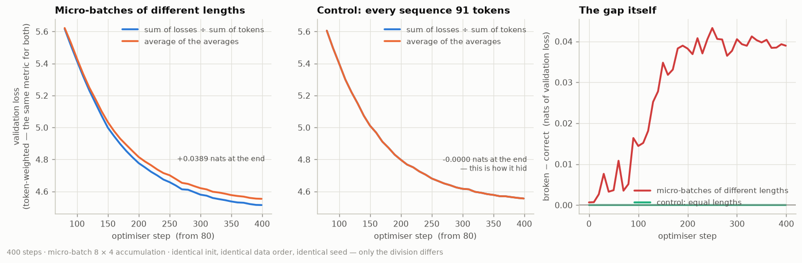

# Deliverable 3 — breaking gradient accumulation on purpose

## 1. The arithmetic, computed rather than quoted

| micro-batch | valid tokens | average loss |
| ----------: | -----------: | -----------: |
|           1 |            4 |          2.0 |
|           2 |            4 |          2.0 |
|           3 |            2 |          5.0 |

- token-weighted (correct): **2.6000**
- average of the averages: **3.0000**
- error: **15.4%**

Set every token count to 4 and the two agree exactly (3.0000 vs 3.0000). That is the whole reason it survived in shipping frameworks.

## 2. One real step — the gradients, not just the number

Four length-bucketed micro-batches holding 1,280, 656, 1,432, 280 valid tokens (a 5.1× spread), through the same model at the same weights:

| quantity         | sum ÷ sum of tokens | average of averages | difference |
| ---------------- | ------------------: | ------------------: | ---------: |
| reported loss    |            9.285668 |            9.278541 |     -0.08% |
| gradient L2 norm |            5.874394 |            5.361083 |     -8.74% |

The reported number being wrong is the visible half. The half that actually
matters is that the two gradient vectors are not the same vector:

- cosine similarity **0.989360** — an angle of
  **8.37°** between them
- relative L2 difference **17.26%** of the
  correct gradient's own norm

The optimiser is being pointed somewhere else, not merely told the wrong
distance. Clipping does not rescue this: clipping rescales the length and
leaves the direction exactly as it was.

## 3. Two runs, identical but for the division

400 steps, micro-batch 8 × 4 accumulation, AdamW at 3e-4 with 20 warmup steps, clip 1.0, same seed, same initial weights, same batches in the same order. Both runs are scored on one common token-weighted validation set, so the metric does not move with the thing it measures.

The control arm holds every sequence to 91 tokens — the geometric mean of the bucketed arm's 32-256 range — so it sees the same token budget per micro-batch on average and differs in one thing only: there is no spread between micro-batches for the bug to key on.

| setting                                       | correct | broken | gap (nats) | relative |
| --------------------------------------------- | ------: | -----: | ---------: | -------: |
| micro-batches of different lengths (bucketed) |  4.5150 | 4.5540 |    +0.0389 |   +0.86% |
| control: every micro-batch 91 tokens long     |  4.5560 | 4.5560 |    -0.0000 |   -0.00% |

The left panel is the gap — plotted from step 80 because the opening
descent from 7.6 to 4.7 nats would otherwise squash it flat, which is precisely
how a gap this size stays invisible on a real dashboard. The middle panel is the
identical experiment with the token counts made equal, where the gap is
-0.0000 nats: the bug hiding, reproduced. The right panel is the
difference between the two curves in each setting, which is the only view where
neither of them can be mistaken for the other.

**The most uncomfortable number in this whole deliverable is a small one.** The
loss the broken run *printed* was wrong by only -0.33% on average
over the 400 steps — well inside the step-to-step noise of any real dashboard
and, at every single step, entirely plausible. Meanwhile the gradient it fed the
optimiser was 17.3% off and pointing
8.4° away. The printed number is nearly innocent while the
training is wrong. That asymmetry is the reason this bug survived in shipping
frameworks until 2024, and it is the reason to check the reduction directly
instead of watching the curve.

**A note on scale.** +0.0389 nats after 400 steps on an 8.3M model
is small, and I am not going to inflate it. What makes it worth the section is
that it is (a) exactly reproducible, (b) exactly zero in the control, and (c) a
*systematic* bias rather than noise — it is the same wrong direction on every
step of a run that would go on for weeks, on micro-batches whose token counts in
production vary far more than the 5.1×
here.
