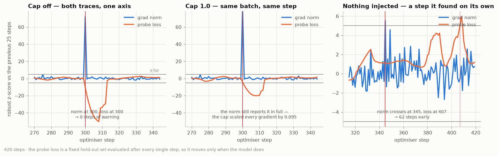

# Deliverable 4 — the grad norm, logged every step

420 steps, micro-batch 8 × 4 accumulation, wiki lane only. Logged every step: the global gradient L2 norm **before** clipping, the clip scale, the training loss, and a probe loss on a fixed held-out set of 4,096 tokens evaluated after the optimiser step.

## 1. Unprompted — the step the detector found on its own

This is the deliverable, and it was not arranged. Across the 420 steps of
the uncapped arm, 1 steps crossed 5-sigma on the gradient norm.
1 of them was followed by a
5-sigma crossing of the probe loss at a **later** step.

The clearest is **step 345**. The gradient norm went to
1.405 — 5.5 sigma away from its own recent
behaviour — while the probe loss stayed inside its noise band. The probe did not
cross until step 407: **62 steps later**. Anyone
watching only the loss had 62 steps of a run that looked
completely healthy, and by the time the loss moved, the batches responsible had
been gone for 62 steps.

| norm crossed at |  norm |   z | loss crossed at |   z | lead (steps) |
| --------------: | ----: | --: | --------------: | --: | -----------: |
|             345 | 1.405 | 5.5 |             407 | 5.0 |          +62 |

## 2. The controlled case — where the loss never finds out at all

At step 300 the run is handed one global batch of real source code — a lane this model has never seen — and then goes straight back to wiki. Nothing else changes. This is a data contamination: the kind of thing a mixture bug does quietly.

|                                                      | cap off | cap 1.0 |
| ---------------------------------------------------- | ------: | ------: |
| gradient norm at the anomalous step                  |  10.765 |  10.572 |
| its z-score against the previous 25 steps            |    72.1 |    82.2 |
| clip scale applied                                   |   1.000 |   0.095 |
| first step the probe loss crossed 5 sigma afterwards |     300 |     301 |
| the probe loss's own z-score there                   |   -10.1 |    -8.1 |
| warning the norm gave                                | 0 steps | 1 steps |

The gradient norm registered the contaminated batch at
**72 sigma** — the largest excursion
anywhere in the run, 13x
the median norm.

The probe loss crossed at step 300:
**0 steps of warning**.
The batch responsible was gone by then — one step of code in a run of wiki — so
whatever diagnosis was going to happen had to start from the norm, because by
the time the loss reacted the evidence was
0 steps in the past.

Worth saying plainly: the probe's reaction was
a *fall* of 10 sigma.
An out-of-distribution batch does not have to make the loss worse to have
damaged the run, and a one-sided alarm would have missed it entirely. That is
not a hypothetical — the first version of this experiment tested only for the
loss rising, reported "never", and was wrong.

The right column is the cap engaging on the same batch: every gradient scaled by
**0.095**, a
11x reduction, with the direction left
exactly as it was. Note that the norm is measured *before* the cap, which is why
the capped arm still reports the full
82 sigma. Logged after clipping it
would sit pinned at the threshold and tell you nothing — a small detail that is
the difference between a useful trace and a flat line.

(The two arms report slightly different norms at step 300 because
clipping changed the trajectory earlier in the run; it is the same batch through
two models that have already diverged.)

Left: the injected anomaly, uncapped. Middle: the same batch with the cap on.
Right: step
345, which nobody arranged.

Both traces are drawn on one axis as robust z-scores against their own previous
25 steps. That is the only honest way to put a loss in nats and a norm in
gradient units on one plot: a second y-axis would let me slide one curve against
the other until the story looked however I wanted it to.

## 3. What the trace costs, and where the cap should go

The grad norm is one sum of squares over tensors that are already in memory and
that the optimiser is about to read anyway: **2.20 ms**, against a median step of 223 ms — 0.99% of the clock. It is the cheapest trace on the dashboard and the only one that is ever
early. The loss answers *is it learning*; the norm answers *is it about to
stop*.

For V5 that settles three things. Log the norm from step one. Clip from step
one. And choose the threshold from the norm's own distribution rather than from
habit: in this run the median norm was
0.814, the 99th percentile
1.994, and the
contaminated batch 10.8. A cap of 1.0 sits at the
82th
percentile — it clips a fifth of ordinary steps, which is more than I would want
on a real run. On this evidence I would set it nearer
2.0: high enough to
leave normal steps alone, low enough that the step-300 batch is still
cut by 5x.
That is a number chosen from data, which is the whole ask.
