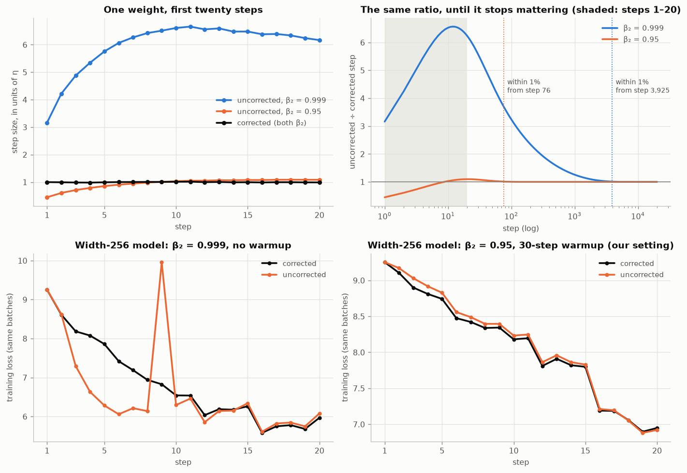
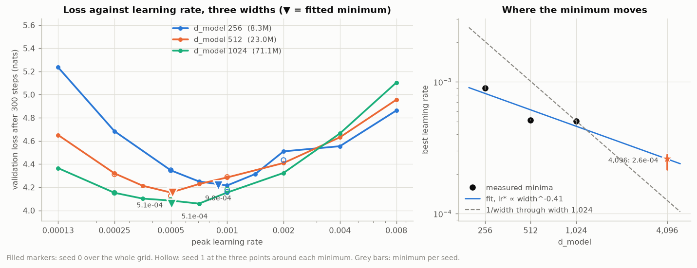

# From a gradient to a distance

**ERA V5 · Session 11 · Optimizers and Learning-Rate Schedules**

A gradient gives a direction and not a distance. This session's five deliverables measure the rules
that turn one into the other, on the Session 10 GPT (4 layers, byte-level BPE tokenizer, the same
committed corpus slice), trained for real. Each deliverable is a script that runs on its own and
writes its own JSON (every number), Markdown (the write-up) and PNG (the figure).

- **Repo:** https://github.com/amukka/ERA_V5/tree/main/session11_Optimizers
- **Notebook:** [`session11.ipynb`](session11.ipynb), executed. E1 and E2's closed form run live in it; the training
  experiments render the evidence `run_all.py` produced.
- **Evidence:** [`results/`](results/): one `.md`, one `.json` and one `.png` per deliverable
- **Machine:** Apple M4, torch 2.13.0, device `mps`, Python 3.14.5

Every number below was produced by the code in this directory on that machine.

---

## The five deliverables

| # | Ask | Script | Headline |
|---|---|---|---|
| 1 | Adam by hand for one weight and five gradients, checked against PyTorch | [`e1_adam_by_hand.py`](experiments/e1_adam_by_hand.py) | m, v, m̂, v̂ and the step agree to **≥ 13.3 decimals** in float64 |
| 2 | Bias correction off, first twenty steps both ways, and when it stops mattering | [`e2_bias_correction.py`](experiments/e2_bias_correction.py) | the step is within 1% from step **76** at β₂ = 0.95 and step **3,925** at β₂ = 0.999; the loss never fully recovers in 300 steps |
| 3 | The update-to-weight ratio per layer, and the step where warmup stops changing it | [`e3_update_ratio.py`](experiments/e3_update_ratio.py) | the ratio peaks as warmup ends and rejoins the no-warmup curve at step **31 / 65 / 98** for W = 25 / 50 / 100 |
| 4 | Cosine against WSD, 300 steps planned, both stopped at 200 | [`e4_cosine_vs_wsd.py`](experiments/e4_cosine_vs_wsd.py) | WSD **4.289** vs cosine **4.369**, WSD ahead on every seed; **keep WSD** |
| 5 | Learning-rate sweeps at widths 256, 512 and 1,024; a value for 4,096 | [`e5_lr_width.py`](experiments/e5_lr_width.py) | minima **9.0e-4 / 5.1e-4 / 5.1e-4**; for 4,096 I would use **2.6e-4**, with low confidence (about a factor of two) |

---

## The setup, shared by E2 to E5

| | |
|---|---|
| model | Session 10's GPT: pre-norm, learned positions, GELU MLP, untied head, 64-wide heads, every matrix N(0, 0.02) |
| widths | d_model 256 (8.3M params) for E2 to E4; 256, 512 and 1,024 (8.3M, 23.0M, 71.1M) for E5 |
| data | the Session 10 slice (3.35M train tokens), fixed 128-token windows, 32 rows: **4,096 tokens per step** |
| optimiser | AdamW, β = (0.9, 0.95), ε = 1e-8, decoupled decay 0.1, **LayerNorm scales and biases excluded from decay** |
| clipping | global grad norm clipped at 1.0 |
| length | 300 steps unless stated |
| score | held-out loss on the same 16 validation batches (65,536 tokens) for every run |

**The width-256 learning rate is measured, not picked.** E2 and E3 train at the best point of E5's
width-256 sweep (1e-3), and E4 sweeps each of its two schedules separately. `run_all.py` therefore
runs E5 second, straight after E1.

---

## 1 · Adam by hand

→ [`results/e1_adam_by_hand.md`](results/e1_adam_by_hand.md)

One weight at w = 1.0, the session's five gradients (0.50, 0.40, 0.60, 0.45, 0.55), η = 1e-3,
β₁ = 0.9, β₂ = 0.999, ε = 1e-8. The hand version is plain Python floats following Section 6's five
lines:

| t | g | m | v | m̂ | v̂ | step | w after |
|--:|--:|--:|--:|--:|--:|--:|--:|
| 1 | 0.50 | 0.050000 | 0.00025000 | 0.500000 | 0.250000 | −0.001000000 | 0.999000000 |
| 2 | 0.40 | 0.085000 | 0.00040975 | 0.447368 | 0.204977 | −0.000988126 | 0.998011874 |
| 3 | 0.60 | 0.136500 | 0.00076934 | 0.503690 | 0.256703 | −0.000994140 | 0.997017734 |
| 4 | 0.45 | 0.167850 | 0.00097107 | 0.488078 | 0.243132 | −0.000989847 | 0.996027887 |
| 5 | 0.55 | 0.206065 | 0.00127260 | 0.503199 | 0.255030 | −0.000996425 | 0.995031463 |

This matches the session's table at every printed digit. `torch.optim.Adam` was then fed the same
five gradients. m and v were read from its state, m̂ and v̂ were recovered from them with its own
step counter, and the step was taken as the change in the weight:

| quantity | float64 decimals of agreement | float32 decimals of agreement |
|---|--:|--:|
| m | 15.7 | 7.8 |
| v | 15.8 | 7.2 |
| m̂ | 15.6 | 7.8 |
| v̂ | 15.7 | 7.2 |
| step | 13.3 | 4.9 |
| w | exact | 7.9 |

**Several decimal places, as asked: at least 13 in float64.** The float32 step is the outlier, and
not because the algorithm disagrees. PyTorch never stores the step, so it is recovered as
`w_after − w_before`, and subtracting two float32 numbers near 1.0 to get 1e-3 throws away about four
digits. A third pass repeats the check for AdamW with decay 0.1 and agrees to 13.1 decimals. The
decoupled term moved the weight by 1e-4 at step 1, a tenth of η, and is not divided by √v̂.

Every step lands between **98.8% and 100.0% of η** while the gradients vary by 50%. The gradient
sets the direction and η sets the distance.

---

## 2 · Bias correction off

→ [`results/e2_bias_correction.md`](results/e2_bias_correction.md) · 

**One weight, twenty steps.** Dividing the two update rules gives the ratio of the uncorrected step
to the corrected one in closed form, r(t) = (1 − β₁ᵗ) / √(1 − β₂ᵗ), whatever the gradients were. So
"when does the difference stop mattering" has an exact answer for a single weight:

| β₂ | step 1 | largest overshoot | step 20 | within 10% from step | within 1% from step |
|--:|--:|--:|--:|--:|--:|
| 0.999 (Adam's default, the session's example) | 3.16× | 6.57× at step 12 | 6.24× | 1,751 | **3,925** |
| 0.95 (what we train with) | 0.45× | 1.10× at step 20 | 1.10× | 6 | **76** |

- **The session's 3.16× is only step 1.** At β₂ = 0.999 the uncorrected step keeps *growing* to 6.6η,
  because m's first weight (0.1) is a hundred times v's (0.001). It then takes thousands of steps to
  come back, since √(1 − 0.999ᵗ) is still 0.80 at step 1,000. Over the first twenty steps the
  uncorrected weight travels 119.5η instead of 19.9η.
- **At β₂ = 0.95 the error runs the other way first.** Uncorrected, √v = √0.05·|g| = 0.22|g| against
  m = 0.10g, so step 1 is only 0.45η. The first step is too small whenever β₂ < 0.99.
- **The answer is a property of β₂**, roughly 4/(1 − β₂) steps for the 1% level, not one number.

**The width-256 model, 300 steps.** Corrected and uncorrected runs share seed and batches. A second
corrected seed supplies the noise yardstick.

| β₂ | warmup | Δ val at step 20 | Δ val at 300 | seed noise | gap inside noise from | gap frozen from |
|--:|--:|--:|--:|--:|--:|--:|
| 0.999 | 0 | +0.128 | +0.674 | 0.065 | never | 100 |
| 0.999 | 30 | −0.758 | +0.683 | 0.013 | never | 270 |
| 0.95 | 0 | −0.021 | **−0.335** | 0.065 | never | 160 |
| 0.95 | 30 | −0.037 | +0.139 | 0.076 | never | 60 |

Δ is uncorrected minus corrected, so positive means turning correction off hurt.

- **The loss does not forget the first few dozen steps.** In no setting does the uncorrected run come
  back inside seed noise within 300 steps. The step rule stops differing on schedule, but the weights
  it produced meanwhile are different weights. What does stop is the *change*: after the "gap frozen"
  step the gap is a constant offset.
- **β₂ = 0.999 without warmup is visibly dangerous.** The figure's bottom-left panel shows the
  uncorrected run's loss jump back to **9.96 at step 9**, almost its starting value, when the 6×
  step lands.
- **β₂ = 0.95 without warmup: turning correction off helped, by 0.34 nats.** The uncorrected first
  steps start at 0.45η and climb to η, which is an accidental warmup. A real warmup still wins: the
  corrected run with 30 warmup steps finished at 4.216, below the uncorrected no-warmup run's 4.265.
- **Our setting, β₂ = 0.95 with warmup:** +0.14 against seed noise of 0.08, and frozen by step 60.
  Warmup had already done the job bias correction protects against.

---

## 3 · The update-to-weight ratio, per layer

→ [`results/e3_update_ratio.md`](results/e3_update_ratio.md) · 

‖W_after − W_before‖ / ‖W_before‖ for all 19 weight matrices at every step, in four runs with warmup
W = 0, 25, 50 and 100. **They share one cosine curve, and warmup only multiplies it**, so after step W
the four runs receive identical learning rates. Any difference left is carried by the optimiser
state and the weights, not by a differently shaped schedule. A second no-warmup seed supplies the
noise band (±9% on the median-over-layers curve).

| warmup W | ratio peaks at | rejoins the no-warmup curve | late offset (steps 150–300) | ‖W‖ no-warmup ÷ warmup | peak ratio | val loss @300 |
|--:|--:|--:|--:|--:|--:|--:|
| 0 | 1 | — | — | — | 5.0e-2 | 4.600 |
| 25 | 31 | **31** | +8.6% | 1.047 | 1.2e-2 | 4.297 |
| 50 | 52 | **65** | +7.7% | 1.058 | 1.1e-2 | 4.170 |
| 100 | 98 | **98** | +8.6% | 1.073 | 7.8e-3 | 4.171 |

- **Warmup stops changing the ratio as soon as it ends.** The ratio climbs with η for W steps and
  peaks at step 31, 52 and 98. It is back inside the no-warmup curve's noise band by step 31, 65 and
  98. Per layer, the median rejoin step is 36, 65 and 106. It tracks W, not a fixed step. The first
  block's matrices and the output head rejoin last, and some of them not at all with W = 100.
- **It leaves a small permanent offset, and the offset is in the weights.** From step 150 the warmed-up
  runs' ratio sits about 8% above the no-warmup run's, against 1% between two no-warmup seeds. The
  no-warmup run's weights finish 5 to 7% *larger*. Its first steps were 1/20 of each weight and
  pushed every matrix outward, and a larger ‖W‖ divides the same Adam step into a smaller ratio.
- **Why warmup is needed at all.** Divided by η, the ratio is 27 over the first five steps and 10 over
  the last fifty. Early gradients agree, so m̂/√v̂ ≈ 1 and every weight takes a near-full step. Warmup
  cannot change that ratio per unit η. It can only keep η small while the ratio is high.
- **What it bought:** 0.43 nats at step 300 for 50 steps of warmup. Going to 100 bought nothing more.
  Every run ends at the healthy ~1e-3 ratio Section 9 asks for.

Our step-1 ratio, 5.0e-2, is larger than Section 9's 19.2e-3 because this model initialises every
matrix at 0.02 regardless of width, so η = 1e-3 is 1/20 of a typical weight.

---

## 4 · Cosine against WSD, stopped at step 200

→ [`results/e4_cosine_vs_wsd.md`](results/e4_cosine_vs_wsd.md) · 

Both are planned for 300 steps with 30 steps of warmup and decay to zero. WSD holds the peak until
step 240 and decays linearly over the last 20%. **Each schedule got its own six-point learning-rate
sweep first**, and both came out best at 1e-3. Three seeds were run at that rate:

| model | lr at the stop (÷ peak) | val loss, 3 seeds |
|---|--:|--:|
| **cosine, stopped at 200** | 31% | **4.369 ± 0.052** |
| **WSD, stopped at 200** | 100% | **4.289 ± 0.043** |
| WSD, step-160 checkpoint decayed to 0 by step 200 | 0% | 4.304 ± 0.046 |
| cosine planned for 200 (reference) | 0% | 4.579 ± 0.058 |
| cosine, completed at 300 | 0% | 4.267 ± 0.048 |
| WSD, completed at 300 | 0% | 4.046 ± 0.020 |

Paired by seed, **WSD stopped − cosine stopped = −0.089 / −0.067 / −0.083** (−0.079 ± 0.011).

**I would keep the WSD model.** It has the lower loss on every seed, and it is still a usable
checkpoint rather than an end point. It sits at the peak learning rate with nothing spent, so it can
resume toward 300 or beyond, or take a short decay whenever a finished model is needed. The cosine
model has already spent 69% of its learning rate on a decay aimed at a step it will never reach.

**Two things came out against expectation, and they share a cause:**

- Cosine *planned* for 200 finished **0.21 worse** than the 300-step cosine halted at 200.
- Decaying WSD from its step-160 checkpoint ended **0.015 worse** than just stopping it at full rate.

200 to 300 steps is far from converged for this model. The loss is still falling by ~0.5 nats per
hundred steps at the peak, so steps at the peak are worth more than the noise a decay suppresses,
and the ranking follows the area under each learning-rate curve. The WSD result that transfers to a
long run is its flexibility, not this margin. One caveat: the planned-200 cosine used the rate tuned
for 300 steps, so it is a reference, not a tuned competitor.

**Why both sides had to be tuned.** From the tuning grid, at step 200, the same two schedules can be
reported three different ways depending only on which side got its best rate:

| comparison | cosine @200 | WSD @200 | WSD − cosine |
|---|--:|--:|--:|
| both tuned | 4.385 | 4.297 | −0.089 |
| tuned cosine against WSD at 2.83e-3 | 4.385 | 4.759 | **+0.374** (cosine "wins") |
| cosine at 2.83e-3 against tuned WSD | 4.771 | 4.297 | **−0.474** (WSD "wins" 5× bigger) |

---

## 5 · Learning rate against width

→ [`results/e5_lr_width.md`](results/e5_lr_width.md) · 

Standard parameterisation, 300 steps, 30-step warmup, cosine to 10%. A factor-2 grid from 1.25e-4 to
8e-3 at each width. The three points around each minimum were repeated with a second seed, and
half-octave points were added either side. The minimum is the vertex of a parabola in log₂(lr).

| width | params | best grid point | val loss | **fitted minimum** | per-seed minima |
|--:|--:|--:|--:|--:|--:|
| 256 | 8.3M | 1.0e-3 | 4.216 | **9.0e-4** | 8.8e-4 – 9.4e-4 |
| 512 | 23.0M | 5.0e-4 | 4.155 | **5.1e-4** | 5.1e-4 – 5.2e-4 |
| 1,024 | 71.1M | 5.0e-4 | 4.085 | **5.1e-4** | 4.7e-4 – 5.2e-4 |

The minima move left as the model widens, as Section 12 says, but not as a clean power law. A line
through all three has slope **−0.41**, against Section 12's −1. The local slope is −0.81 from 256 to
512 and −0.02 from 512 to 1,024.

| estimate for d_model 4,096 | learning rate |
|---|--:|
| **power law through the three minima (what I would use)** | **2.6e-4** |
| same fit, over per-seed minima | 2.2e-4 – 2.8e-4 |
| the flattening 512 → 1,024 segment, continued | 4.9e-4 |
| Section 12's 1/width, anchored at our width-1,024 minimum | 1.3e-4 |
| width 256's minimum carried across unchanged | 9.0e-4 |

**I would use 2.6e-4, as the centre of a short confirmation sweep at the real width, not as a
launch value. Confidence is low: roughly a factor of two either way.** The per-seed range looks
tight, but it only measures seed noise. The dominant error is the curve's shape. Three points cannot
separate a power law (2.6e-4) from a flattening curve (4.9e-4), and the textbook rule says 1.3e-4.

There is a concrete reason our slope is shallower than −1. Every matrix here starts at a fixed 0.02.
Under a textbook 1/√fan-in initialisation the weights shrink as width grows, so the same η is a
relatively bigger step on a wider model, and that is part of why the optimum moves left. With a
fixed init, E3's step-to-weight ratio at a given η is the same at every width, so that part of the
drift is missing. A fourth width at 2,048 would settle the shape, and a longer budget would matter
too, since the optimum at 300 steps is not the optimum at 30,000. Or use muP, under which this table
collapses to one column.

---

## Honest notes

- **Two measures were rewritten after the first run, because the first version answered the wrong
  question.** E3's first "warmup stops changing it" test required the warmed-up curve to stay within
  ±10% of the no-warmup curve until step 300. Almost every layer then "settled" near step 290. That
  measured the permanent weight-norm offset, not warmup. The final version separates the rejoin step
  from the offset, uses a seed-noise band, and checks the weight-norm explanation by measuring the
  norms. E2 gained its "gap frozen" column for the same reason.
- **The runs are not bit-reproducible on MPS.** Rerunning E2's most unstable arm (β₂ = 0.999, no
  warmup, no correction) gave 5.268 instead of 5.228. Stable runs reproduced to four decimals. Every
  conclusion above rests on differences several times larger than the seed noise measured next to
  them.
- **Everything is short.** 300 steps of 4,096 tokens is about 1.2M tokens, a third of an epoch of this
  slice. That regime is why WSD's time at the peak pays so well in E4, and it limits how far E5's
  minima can be carried.

---

## Reproduce

```bash
pip install -r requirements.txt
python run_all.py              # everything, about 90 minutes on an Apple M4
python run_all.py e1           # just E1, one second
python tools/build_notebook.py --run
```

E5 caches every run in `results/e5_runs.json`, so an interrupted sweep resumes. E2, E3 and E4 accept
`--reuse` to regenerate their write-ups and figures from the saved JSON without retraining. The first
run tokenizes the corpus slice into `data/tokens_cache.npz`, which takes about three seconds and is
git-ignored.

```
session11_Optimizers/
├── run_all.py                 # E1, E5, E2, E3, E4 in that order
├── experiments/               # one script per deliverable
├── src/
│   ├── model.py               # Session 10's GPT with width as a parameter
│   ├── train.py               # the loop, schedules, param groups, ManualAdamW, ratio logging
│   ├── tuned.py               # reads E5's width-256 optimum for E2 and E3
│   ├── data.py, report.py, plots.py
├── tools/build_notebook.py
├── data/corpus_slice.jsonl.gz # the Session 10 slice
├── tokenizer/                 # the Session 2 tokenizer
└── results/                   # the evidence
```
