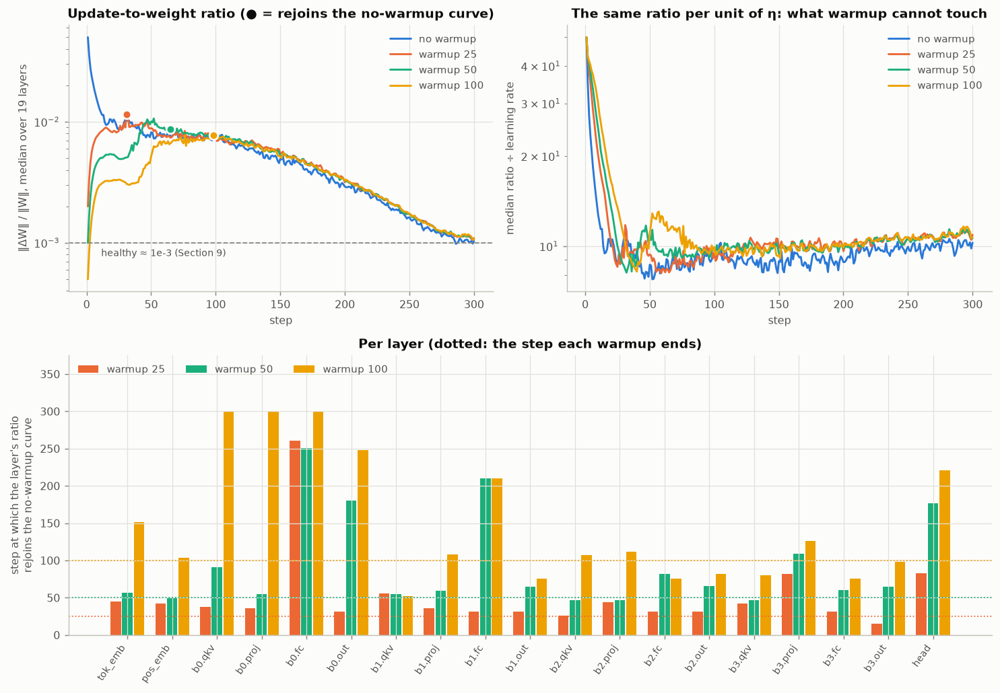

# E3 · Update-to-weight ratio, per layer, and the end of warmup

Width-256 model, peak lr 1.0e-03 (best point of E5's width-256 sweep), 300 steps. One cosine to 10% for every run, with a warmup multiplier min(1, (t+1)/W) laid over it, so after step W the learning rates are identical. Ratio = ‖W_after − W_before‖ / ‖W_before‖ for each of the 19 weight matrices, at every step. A second no-warmup run with seed 1 supplies the noise band.

## When warmup stops changing the ratio

All measured on the median-over-layers ratio, smoothed over 9 steps, against the no-warmup run. The noise band is how far two no-warmup runs with different seeds sit apart (±9%).

- **Stops driving it**: the step at which the ratio peaks.
- **Rejoins**: the first step after the peak at which the warmed-up curve is inside the noise band of the no-warmup curve.
- **Late offset**: the median gap between the two curves over steps 150–300. The same number for two no-warmup seeds is +1.0%.
- **‖W‖ ratio**: final weight norm without warmup ÷ with it, median over layers.
- **Stays inside**: the first step after which the curve never leaves the band again.

| warmup W | stops driving it | rejoins | late offset | ‖W‖ no-warmup ÷ warmup | stays inside | peak ratio | val loss @300 |
| -------: | ---------------: | ------: | ----------: | ---------------------: | -----------: | ---------: | ------------: |
|        0 |                1 |       — |           — |                      — |            — |   4.99e-02 |        4.6002 |
|       25 |           **31** |  **31** |       +8.6% |                  1.047 |          291 |   1.15e-02 |        4.2970 |
|       50 |           **52** |  **65** |       +7.7% |                  1.058 |          296 |   1.06e-02 |        4.1701 |
|      100 |           **98** |  **98** |       +8.6% |                  1.073 |          298 |   7.76e-03 |        4.1711 |

**Warmup stops driving the ratio exactly when it ends.** The median ratio peaks at step 31, 52 and 98 for W = 25, 50 and 100: the ratio climbs with η for W steps and then follows the shared schedule down. It rejoins the no-warmup curve at step 31, 65 and 98, which is the answer to the assignment's question: **past that step, warmup is no longer changing the ratio.** Layer by layer (table below) the rejoin step has a median of 36 / 65 / 106 for W = 25 / 50 / 100, so it tracks W rather than any fixed step.

**What it leaves behind is a small permanent offset, and the offset is in the weights.** From step 150 on, the warmed-up runs' ratio sits +9% / +8% / +9% above the no-warmup run's, against +1% between two no-warmup seeds. That is why the "stays inside" column lands near step 300: the curves touch the band's edge rather than sit inside it. Most of the cause is in the denominator. The no-warmup run's weights finish +5.8% larger (median over layers, against W = 50), because its first steps were 1/20 of each weight in size and pushed every matrix outward. A larger ‖W‖ divides the same Adam step into a smaller ratio, which accounts for roughly 6 of the 8 points; the rest is inside what one extra seed can move. (The norms come from re-running each arm once with the same seed, since the first pass did not record them.)

**The largest ratio the run ever sees** is 5.0e-02 without warmup, at step 1, and 1.2e-02 / 1.1e-02 / 7.8e-03 with W = 25 / 50 / 100. Section 9 quotes 19.2e-3 against 2.83e-3 at d_model 4,096. Our starting ratio is larger because every matrix is initialised at 0.02 whatever its width, so a full η = 1e-3 step is 1/20 of a weight of typical size 0.02. By step 300 every run is at the healthy 1e-3 (1.03e-03 without warmup, 1.06e-03 with W = 50).

**Where warmup paid off.** Validation loss at step 300 was 4.600 without warmup (a second seed: 4.673), 4.297 with 25 steps, 4.170 with 50 and 4.171 with 100. Fifty steps bought 0.43 nats. Doubling to 100 bought nothing more.

## Every layer

Step-1 ratio for the no-warmup run, peak and peak step with W = 50, step-300 ratio without warmup, the layer's seed-noise band, then the step at which that layer's ratio rejoins the no-warmup curve for each warmup length.

| layer   | step 1, W=0 | peak, W=50 | peak step | step 300 | noise band | W=25 | W=50 | W=100 |
| ------- | ----------: | ---------: | --------: | -------: | ---------: | ---: | ---: | ----: |
| tok_emb |    1.46e-02 |   6.75e-03 |        52 | 5.74e-04 |        ±3% |   45 |   57 |   151 |
| pos_emb |    3.55e-02 |   9.64e-03 |        50 | 8.75e-04 |        ±8% |   42 |   50 |   104 |
| b0.qkv  |    4.99e-02 |   1.54e-02 |        52 | 1.03e-03 |        ±7% |   38 |   91 | never |
| b0.proj |    4.99e-02 |   1.00e-02 |        48 | 9.90e-04 |       ±13% |   36 |   55 | never |
| b0.fc   |    5.00e-02 |   1.14e-02 |        52 | 9.47e-04 |        ±8% |  261 |  251 | never |
| b0.out  |    4.99e-02 |   1.09e-02 |        52 | 9.62e-04 |        ±8% |   31 |  180 |   248 |
| b1.qkv  |    4.99e-02 |   1.35e-02 |        52 | 1.01e-03 |       ±21% |   56 |   55 |    52 |
| b1.proj |    4.99e-02 |   9.04e-03 |        52 | 1.12e-03 |       ±13% |   36 |   59 |   108 |
| b1.fc   |    4.99e-02 |   1.12e-02 |        52 | 1.03e-03 |        ±8% |   31 |  210 |   210 |
| b1.out  |    4.99e-02 |   1.11e-02 |        47 | 1.04e-03 |        ±8% |   31 |   65 |    76 |
| b2.qkv  |    4.95e-02 |   1.42e-02 |        47 | 9.29e-04 |       ±21% |   26 |   47 |   107 |
| b2.proj |    4.98e-02 |   9.44e-03 |        47 | 1.10e-03 |       ±12% |   44 |   47 |   112 |
| b2.fc   |    5.00e-02 |   1.14e-02 |        47 | 1.04e-03 |       ±11% |   31 |   82 |    76 |
| b2.out  |    5.00e-02 |   1.08e-02 |        47 | 1.07e-03 |        ±8% |   31 |   66 |    82 |
| b3.qkv  |    4.94e-02 |   1.52e-02 |        47 | 9.94e-04 |       ±15% |   42 |   47 |    80 |
| b3.proj |    4.99e-02 |   9.18e-03 |        47 | 1.07e-03 |        ±9% |   82 |  109 |   126 |
| b3.fc   |    5.00e-02 |   1.12e-02 |        47 | 1.02e-03 |       ±13% |   31 |   60 |    76 |
| b3.out  |    5.01e-02 |   9.91e-03 |        47 | 1.11e-03 |        ±8% |   15 |   65 |    98 |
| head    |    4.98e-02 |   2.42e-02 |        33 | 1.03e-03 |        ±5% |   83 |  177 |   221 |

## Why warmup is needed at all

The right-hand panel divides the ratio by the learning rate. That removes everything the schedule does and leaves what Adam does with the gradients it is given. Without warmup, the median ratio per unit η is 27.4 over the first five steps and 10.1 over the last fifty, 2.7× higher at the start. That is Section 9's argument measured: early gradients agree with each other, so m̂/√v̂ is near 1 for most weights and every weight takes close to a full η step. Warmup cannot change that ratio per unit η. It can only keep η small while it is high.
