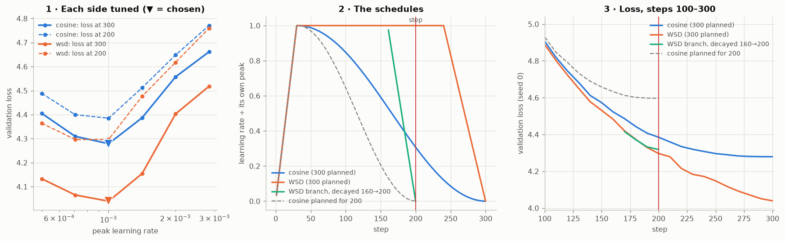

# E4 · Cosine against WSD, stopped at step 200

Width-256 model. Both schedules planned for 300 steps, 30 steps of warmup, decay to zero. WSD decays over the last 20%. Three seeds at each schedule's own tuned rate. Mean ± sample std of held-out loss.

## 1 · Tuning both sides first

Seed 0, each rate a full 300-step run. Each schedule is tuned on the step-300 loss, the number it was designed to deliver.

|  peak lr | cosine @300 | WSD @300 | cosine @200 | WSD @200 |
| -------: | ----------: | -------: | ----------: | -------: |
| 5.00e-04 |      4.4054 |   4.1332 |      4.4885 |   4.3642 |
| 7.07e-04 |      4.3097 |   4.0658 |      4.4000 |   4.2966 |
| 1.00e-03 |      4.2792 |   4.0398 |      4.3852 |   4.2966 |
| 1.41e-03 |      4.3869 |   4.1546 |      4.5119 |   4.4763 |
| 2.00e-03 |      4.5573 |   4.4029 |      4.6481 |   4.6179 |
| 2.83e-03 |      4.6614 |   4.5178 |      4.7708 |   4.7592 |

Chosen: cosine **1.00e-03**, WSD **1.00e-03**.

## 2 · The comparison, three seeds

| model                                   | lr at the stop (÷ peak) |        val loss |
| --------------------------------------- | ----------------------: | --------------: |
| cosine, stopped at 200                  |                     31% | 4.3685 ± 0.0524 |
| WSD, stopped at 200                     |                    100% | 4.2891 ± 0.0431 |
| WSD, step-160 checkpoint decayed to 200 |                      0% | 4.3035 ± 0.0461 |
| cosine planned for 200 (reference)      |                      0% | 4.5794 ± 0.0582 |
| cosine, completed at 300                |                      0% | 4.2670 ± 0.0480 |
| WSD, completed at 300                   |                      0% | 4.0461 ± 0.0201 |

WSD stopped minus cosine stopped: **-0.0794**. WSD branch minus cosine stopped: **-0.0649**. At the planned end, WSD minus cosine: -0.2209.

Because every pair shares a seed, and so the same initialisation and the same batches, the differences are better judged per seed than from the two spreads:

| paired difference (negative = first is better) |              seed 0 / 1 / 2 |           mean ± std |
| ---------------------------------------------- | --------------------------: | -------------------: |
| WSD stopped − cosine stopped                   | -0.0887 / -0.0669 / -0.0826 | **-0.0794 ± 0.0112** |
| WSD branch − WSD stopped                       | +0.0217 / +0.0091 / +0.0125 |     +0.0145 ± 0.0065 |
| cosine planned for 200 − cosine stopped        | +0.2118 / +0.2048 / +0.2163 |     +0.2110 ± 0.0058 |

## The model I would keep: WSD's step-200 checkpoint

**It is the lower loss, on every seed**, by 0.079 nats on average (every seed between 0.067 and 0.089). And it is the only one of the two that is still a *usable* checkpoint rather than an end point. It sits at the peak learning rate with nothing spent, so it can resume toward 300 or beyond, or be handed a short decay whenever a finished model is needed. The cosine model at step 200 has already spent 69% of its learning rate on a decay aimed at step 300, and resuming it means continuing a schedule that was written for a different run.

## What was not expected

**On this model, at this length, decaying bought less than it cost.** Section 10 expects a model stopped mid-decay to be worse than one planned for that length, and a WSD checkpoint to need its decay before it is competitive. Both came out the other way:

- Cosine *planned* for 200 steps finished +0.211 worse than the 300-step cosine halted at 200.

- Decaying the WSD run from step 160 to 0 over 40 steps ended +0.014 worse than simply stopping it at full rate.

The common cause is that 200 to 300 steps of 4,096 tokens is far from converged for this model. The loss is still falling by about 0.5 nats per hundred steps around step 200, so steps taken at the peak are worth more than the noise suppression a decay buys. Any schedule that spends less time at the peak loses, and the ranking follows the area under each learning-rate curve. On a run long enough to plateau, the decay's benefit is known to reappear, which is why the WSD result that transfers is the flexibility, not the margin.

**One caveat on the planned-200 cosine:** it used the peak rate tuned for a 300-step cosine, not one tuned for 200 steps. It is a reference, not a tuned competitor, and it is not part of the comparison the assignment asks for.

**Why both sides had to be tuned.** Both schedules have their minimum at the same peak here, so a comparison at 1e-3 happens to be fair. At any other single rate it is not, and a mismatched pair can reverse the verdict or inflate it. From the tuning table, at step 200:

| comparison                                | cosine @200 | WSD @200 | WSD − cosine |
| ----------------------------------------- | ----------: | -------: | -----------: |
| both tuned (the comparison above, seed 0) |       4.385 |    4.297 |       -0.089 |
| tuned cosine vs WSD at 2.83e-03           |       4.385 |    4.759 |   **+0.374** |
| cosine at 2.83e-03 vs tuned WSD           |       4.771 |    4.297 |   **-0.474** |

The same two schedules can be reported as cosine winning by 0.37, as WSD winning by 0.09, or as WSD winning by 0.47, depending only on which side was given its best rate. That is the session's closing warning, reproduced on a 300-step run.
