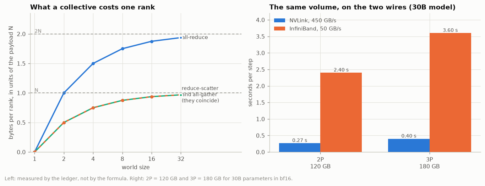

# Thirty-two GPUs that do not exist, holding a model four ways

**ERA V5 · Session 12 · Distributed Training I — Data Parallel and ZeRO**

Thirty-two virtual GPUs, each one a thread that can reach another rank's tensors
only by calling a collective. A small GPT (870,656 parameters) trained on top of
them. Data parallelism and ZeRO stages 1, 2 and 3 implemented side by side, and
then measured: what one rank holds, what one rank sends, and what the clock says.

- **Repo:** https://github.com/amukka/ERA_V5/tree/main/session12_DataParallel_Zero
- **Notebook:** [`session12.ipynb`](session12.ipynb) — all five experiments, executed, with outputs
- **Evidence:** [`results/`](results/) — one `.md` (the write-up), one `.json` (every number), one `.png` (the figure) per experiment
- **Reproduce:** `pip install -r requirements.txt && python run_all.py` — about two minutes
- **Machine:** Apple M4, 10 cores, torch 2.13.0, Python 3.14. No GPU, no `torch.distributed`, no NCCL.

Every number below was produced by the code in this directory on that machine.
Nothing is quoted from the session notes without being recomputed first.

---

## The three results

| | |
|---|---|
| **The measured bytes per weight are the formula, in all 28 cells.** A meter is told about every tensor as an engine allocates it. At W=8 the audit returns 16.000 / 5.500 / 3.750 / 2.000; at W=32, 16.000 / 4.375 / 2.438 / 0.500. The formula is never evaluated inside an engine. | [E3](results/e3_stages.md), [E4](results/e4_ladder.md) |
| **All four arrangements compute bitwise-identical weights.** Not "agree to eight decimals" — every bit of every one of 870,656 numbers, after 12 steps, out of ranks holding between 16 and 0.5 bytes for each of them. | [E2](results/e2_equivalence.md) |
| **The traffic is 1.9375P, 1.9375P, 1.9375P and 2.9062P per rank per step**, counted by a ledger, which is 2P, 2P, 2P and 3P with the (W−1)/W ring discount. A ring all-reduce run one neighbour-to-neighbour send at a time sends exactly 2N(W−1)/W bytes, counted rather than assumed. | [E1](results/e1_mesh.md), [E3](results/e3_stages.md) |

---

## What I had to understand to build this

The assignment asks for 32 virtual GPUs, a demo model on top of them, and ZeRO 1,
2 and 3 simulated. Four decisions fell out of taking that literally, and each one
turned a sentence from the notes into something the code had to be right about.

### 1. A "virtual GPU" is only worth the name if it cannot cheat

The easy version of this assignment is a spreadsheet: multiply 30e9 by
`16/W` and print a table. It would produce the same numbers and demonstrate
nothing, because the numbers would be the formula being retyped.

So a rank here is a thread that owns its tensors, and `mesh.py` is the only way
one rank can see another's. Every collective records the bytes a ring
implementation would put on the wire, and every engine registers each tensor it
allocates with a meter. The bytes-per-weight column and the traffic column are
then *audits of what the code did*, arrived at from the opposite end from the
formula — and if an engine had a redundant buffer in it, the audit would say so
and the formula would not.

The audit catches things a formula cannot. A ZeRO-1 that dropped its gradient
buffer at the end of each step and re-allocated it in the next would meter at
2.375 bytes a weight instead of 4.375 and look like a better ZeRO-1 for it. It
would not be one. PyTorch keeps `.grad` allocated and zeroes it between steps
rather than freeing it, so the gradient buffer is resident state — and **that
persistence is exactly why ZeRO-1 has a floor at 4 bytes**, which is the whole
of section 3 below. The engines here allocate it once, in `__init__`, for that
reason.

### 2. ZeRO is a claim about addresses, not about arithmetic

This is the sentence I would have nodded along to and not believed. So E2 checks
it the strict way: run all four arrangements on identical data and demand
`torch.equal` on every weight.

It passes — but only because I made it possible for it to pass. Every reduction
in `mesh.py` stacks the ranks' contributions **in rank order** and sums along
that axis, for a whole buffer and for a single shard alike. Element by element,
the slice a reduce-scatter returns has been through exactly the additions the
corresponding slice of an all-reduce went through. Floating-point addition is not
associative, so had I reduced in arrival order instead, the four stages would
have agreed to about six decimals and I would have had no way to tell a rounding
difference from a bug.

The same point, from the other side: the honest `ring_all_reduce` in `mesh.py`
does **not** agree bitwise with the direct reduction (2.4e-07 apart), because a
ring adds the ranks in ring order. Real NCCL has this property. It is why
changing the world size of a real run changes its loss curve in the last decimal
place, and it is not a bug in either implementation.

### 3. The gradient buffer is why two of the four arrangements never fit

The memory ladder in the session notes says data parallelism and ZeRO-1 never fit
a 30B model, at any world size. Walking the world size from 1 to 64 shows where
that comes from ([E4](results/e4_ladder.md)):

| arrangement | W=1 | W=2 | W=4 | W=8 | W=16 | W=32 | W=64 | limit |
|---|---:|---:|---:|---:|---:|---:|---:|---:|
| data parallel | 16.000 | 16.000 | 16.000 | 16.000 | 16.000 | 16.000 | 16.000 | **16** |
| ZeRO-1 | 16.000 | 10.000 | 7.000 | 5.500 | 4.750 | 4.375 | 4.188 | **4** |
| ZeRO-2 | 16.000 | 9.000 | 5.500 | 3.750 | 2.875 | 2.438 | 2.219 | **2** |
| ZeRO-3 | 16.000 | 8.000 | 4.000 | 2.000 | 1.000 | 0.500 | 0.250 | **0** |

ZeRO-1 shards the twelve bytes of optimizer state and leaves the 2-byte weights
and the 2-byte gradients replicated on every card. Four bytes a weight is a floor
that no world size touches, and a floor has a model size attached to it:

```
74.5 GiB  ÷  4 bytes/weight  =  20.0 billion parameters
```

**20 billion is the boundary**, and it is a property of the arrangement rather
than of the budget. A 20B model sits exactly on the line; our 30B model needs
111.8 GiB and sits 1.5× past it. Every thousand-GPU cluster in the world is still
one card short for it under ZeRO-1. That single division is the whole argument
for stage 2, and it stays invisible until the ladder is walked far enough for
the flat row to show.

### 4. Two things ZeRO does not do, which the tables hide

**Activations do not shard.** Every arrangement in E3 holds the same 0.62 MiB of
them, because they belong to the rank's own sequences and no other rank has a
copy to share. ZeRO says nothing about activation memory. The tables are
training state only, so the ZeRO-2 row's "68.1 GiB at 32 GPUs" is not a
configuration that fits — it is one with 6.4 GiB left over for everything else,
which is not enough. I read the fitted cells as an upper bound on what is
possible, not as a plan.

**Stage 3 needs a model with seams.** A model whose weights live inside its
modules cannot express "I do not have this layer right now". So the model here is
held as one flat tensor per group with `layer_forward` as a *function* that takes
it, and the backward walks the groups in reverse, re-acquiring each group's
weights and releasing them immediately. That is activation checkpointing, and it
is not incidental to stage 3 — it is what makes releasing a group's weights
during the forward possible at all, since the backward re-acquires them anyway.
All four engines use the same routine, so none of them can win or lose on the
strength of a different backward.

---

## The five experiments

### E1 · Thirty-two virtual GPUs, and three collectives

→ [`results/e1_mesh.md`](results/e1_mesh.md) · 

32 threads, 32 ranks, 32 different slices of text, 8,192 tokens a step. Then the
two checks that everything downstream leans on:

- `all_gather(reduce_scatter(x))` equals `all_reduce(x)` **bitwise**, on every
  rank, for 65,536 random fp32 numbers.
- A ring all-reduce performed one send at a time makes 62 sends per rank at
  W=32 (31 to reduce, 31 to gather) and moves 507,904 bytes — which is
  `2N(W−1)/W` to the byte, `1.9375N`.

The cost per rank does not grow with the world. It *approaches* 2N from below and
stops: 1.0000N at W=2, 1.7500N at W=8, 1.9375N at W=32. Doubling the GPUs does
not double anybody's traffic; it only stops the (W−1)/W discount from helping.
That is the property that makes data parallelism scale at all, and it is easy to
mis-state in the other direction.

Priced for a 30B model, P = 60 GB: 2P is 0.27 s on NVLink and 2.40 s on
InfiniBand; 3P is 0.40 s and 3.60 s. (The session notes' table, recomputed.)

### E2 · The same answer, from all four

→ [`results/e2_equivalence.md`](results/e2_equivalence.md) · 

Three claims, checked in order of how much they could hide.

**32 ranks × 2 sequences is 1 rank × 64.** Checked on the *gradient*, one step,
before an optimizer can amplify anything: averaging 32 partial gradients
reproduces the 64-sequence gradient to **1.3e-06 relative and 0.0000°**. That is
fp32 summation noise. The two runs are the same run.

**And then the part that claim does not cover.** A rank does not put its fp32 gradient on
the wire — it puts 2 bytes a weight on it. Rounding each rank's *partial*
gradient to bf16 and then averaging is not the same as rounding the whole
gradient once: **3.3e-04 relative, 0.020°, 251× the fp32 figure.** Then Adam gets
hold of it. On step 1 the update is `-lr · m̂/(√v̂+ε)` with `m̂ = g` and
`v̂ = g²`, so it is `-lr · sign(g)` whatever the size of `g` — and a gradient
element that differs by 1e-7 between the two runs, if that difference crosses
zero, moves the weight by a full `2·lr = 6e-4`. The drift is at its maximum after
*one step*:

| after N steps | 1 | 2 | 4 | 8 | 12 |
|---|---:|---:|---:|---:|---:|
| max \|w(32 ranks) − w(1 rank)\| | 7.3e-04 | 7.3e-04 | 7.3e-04 | 7.3e-04 | 6.1e-04 |

The scale-free step is the amplifier; bf16 only supplies the disagreement. It
does not compound, because the same normalisation that amplifies it also bounds
it. Neither run is the wrong one — they are two equally valid roundings of the
same mathematical step.

**The four arrangements agree bitwise**, 12 steps, W=32: `max |Δw| vs DP = 0.0`
and `torch.equal` true for all four, out of ranks holding 16.000, 4.375, 2.438
and 0.500 bytes a weight.

**The control.** `NoAverage` is `DataParallel` with the `all_reduce` line
removed and nothing else changed. After 12 steps the 32 copies are 6.2e-03 apart
and separating. Nothing raises an error, the loss still falls, and each rank is
still training a perfectly good language model — there are just 32 of them now,
each on 1/32 of the data. The all-reduce is not a synchronisation detail. It is
the thing that makes 32 copies one model.

### E3 · What each stage costs

→ [`results/e3_stages.md`](results/e3_stages.md) · 

W=32, 8,192 tokens a step. The audit and the formula, computed from opposite
ends:

| arrangement | bytes/weight measured | formula | resident | peak | wire/step | collective calls |
|---|---:|---:|---:|---:|---:|---:|
| data parallel | 16.0000 | 16.0000 | 13.29 MiB | 14.66 MiB | 1.9375P | 6 |
| ZeRO-1 | 4.3750 | 4.3750 | 3.63 MiB | 5.01 MiB | 1.9375P | 12 |
| ZeRO-2 | 2.4375 | 2.4375 | 2.02 MiB | 3.78 MiB | 1.9375P | 12 |
| ZeRO-3 | 0.5000 | 0.5000 | 0.42 MiB | 2.17 MiB | 2.9062P | 18 |

Stages 1 and 2 send **precisely** what data parallelism sends. That is the
identity from E1 doing its work: data parallelism all-reduces, a ring does that
as a reduce-scatter and an all-gather, and stages 1 and 2 perform those same two
phases and keep the slice in between instead of discarding it. Stage 3's extra
half is one all-gather of the weights in the forward and one more in the
backward — 18 calls a step against 6, because every group is now fetched twice.

**The clock, and an honest failure.** The sharded stages update a thirty-second
of the weights and it buys them almost nothing in wall-clock: 40 ms a step
against 34. Timed on its own, the same arithmetic behaves as designed —
**about 23× at 870K parameters and 38× at 64M** (past 32×, because a 2M-element shard also
fits in cache and a 64M-element vector does not). What the run cannot show is
this machine: 32 Python threads on 10 cores, where a tensor operation on 27,000
numbers spends its time in dispatch, holding the interpreter lock, rather than
in arithmetic. The ranks queue behind each other however small their shards get.

**So: the bytes this simulator reports are exact and the seconds are about a
laptop.** Memory per rank and traffic per step are counted, not modelled, and
would be the same numbers on 32 H100s. Wall-clock is not, which is why E5 prices
time from the byte counts and a stated bandwidth instead of from this machine's
clock.

### E4 · The memory wall

→ [`results/e4_ladder.md`](results/e4_ladder.md) · 

Measured bytes per weight at seven world sizes × four arrangements — all 28 cells
match the formula — then multiplied by 30e9 against a card that holds 74.5 GiB:

| arrangement | 8 GPUs | 16 GPUs | 32 GPUs | 64 GPUs | fits from |
|---|---:|---:|---:|---:|---:|
| data parallel | 447.0 | 447.0 | 447.0 | 447.0 | never |
| ZeRO-1 | 153.7 | 132.7 | 122.2 | 117.0 | never |
| ZeRO-2 | 104.8 | 80.3 | **68.1** | **62.0** | 32 GPUs |
| ZeRO-3 | **55.9** | **27.9** | **14.0** | **7.0** | 8 GPUs |

Read the other way: at W=32 the largest model whose state fits one card is 5.0B
under data parallelism, 18.3B under ZeRO-1, 32.8B under ZeRO-2 and 160B under
ZeRO-3. The choice for a 30B model is ZeRO-2 on many GPUs or ZeRO-3 on few, and
nothing else is on the table.

### E5 · Communication that happens during computation costs nothing

→ [`results/e5_overlap.md`](results/e5_overlap.md) · 

A discrete-event model, built from three inputs each from its own place: the
per-layer **shape** of a pass, measured on the real model at every group
boundary; the **volume**, counted by E3's ledger; a **bandwidth**, stated.

Without overlap, 2P over InfiniBand is 33% of an H100 step and **75% of a B200
step**. Same bytes. The compute it has to hide behind got shorter — which is the
one thing about faster hardware that makes this problem worse rather than better.

With overlap, the arrangements separate in a way the volume column does not
predict. The four differ in how their traffic divides between the two windows a
step provides:

| | forward window | backward window | total |
|---|---|---|---|
| data parallel | — | 2P | 2P |
| ZeRO-1, ZeRO-2 | P | P | 2P |
| ZeRO-3 | P | 2P | 3P |

and on 64 × B200 over InfiniBand that produces:

| | data parallel | ZeRO-1 | ZeRO-2 | ZeRO-3 |
|---|---:|---:|---:|---:|
| step time above its own compute | +8.6% | +5.7% | +5.7% | +12.2% |

**Data parallelism and ZeRO-1 move the same 2P and data parallelism pays half as
much again for it.** The reason is not volume, it is windows: data parallelism
has to push all 2P through the backward pass, while stages 1 and 2 put one P in
the backward and the other — the all-gather of the freshly updated weights — in
the next step's forward, where there is compute going spare. **Sharding the
optimizer state bought a better communication schedule as well as the memory**,
which is not in the session notes' cost table and does not follow from it.

Inside a node everything hides: every NVLink row lands within a per cent of its
own compute, stage 3 included.

On bucket size, I could not reproduce the notes' claim that a B200 step's best
bucket is two layers, because that depends on a per-transfer fixed cost the notes
do not state. So I swept the fixed cost instead and found the crossover:

| fixed cost per transfer | 0.01 ms | 1 ms | 5 ms | 10 ms | 25 ms | 50 ms |
|---|---:|---:|---:|---:|---:|---:|
| best bucket, layers | 1 | 1 | 2 | 3 | 6 | 8 |

Below about 5 ms, start transfers as early as possible; above it, the launch cost
of 50 transfers outweighs the earlier start. A production `bucket_size` of a few
hundred megabytes is a bet about which side of that line the cluster is on — and
V4's config bet 2e8 bytes.

---

## What I would carry into V5

Both of the numbers that decide a distributed run — what one rank holds and what
one rank sends — are countable in advance, on a laptop, before a cluster is
booked. That is the practical thing this exercise taught me, and it is why the
whole of this repository is an accounting exercise wrapped around a training loop
rather than the other way round.

On the session's four open questions, what the measurements here can and cannot
settle:

| question | what this repo says |
|---|---|
| ZeRO-2 on 32 GPUs, or ZeRO-3 on 8? | Not settled, and it should not be — it needs a measured step time with activation memory included. But E5 adds a constraint the memory table misses: at 3P, stage 3 stalls waiting for weights on a slow wire, so "ZeRO-3 on 8" wants those 8 inside one node. |
| how many GPUs per node, how many nodes? | Every NVLink row in E5 lands within 1% of its own compute and every InfiniBand row does not. Keep the traffic in the node. |
| 8-bit from the start? | Out of scope here; nothing in this repo measures it. |
| does state go to system memory? | Not needed at the world sizes measured — ZeRO-2 fits from 32 GPUs and ZeRO-3 from 8, on training state. Offload is for when the binding constraint is memory, and at these world sizes it is not. |

## Layout

```
src/mesh.py       32 virtual GPUs, the three collectives, the honest ring, the byte ledger
src/model.py      a GPT cut into groups; forward and backward one group at a time
src/engines.py    data parallelism and ZeRO 1/2/3, and the memory meter
src/sim.py        one way to start a run; the 30B projection
src/overlap.py    a discrete-event model of one pass and the transfers it overlaps
src/data.py       538 KB of the session-6 mixture, read as bytes; per-rank slicing
experiments/      five experiments, each runnable on its own, each writing its own evidence
results/          the evidence: one .md, one .json, one .png per experiment
tools/            builds session12.ipynb from the experiment modules
```

Run everything with `python run_all.py`, or one experiment with
`python experiments/e3_stages.py`. Rebuild and re-execute the notebook with
`python tools/build_notebook.py --run`.
