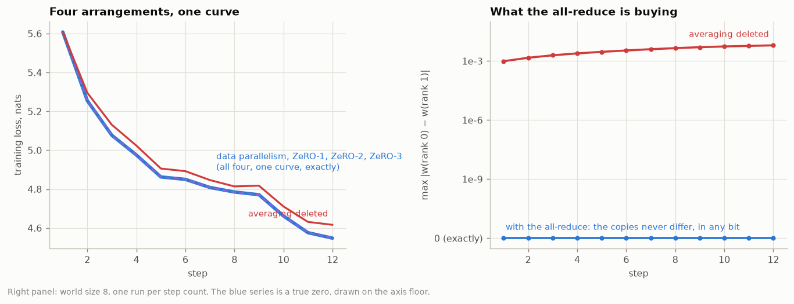

# E2 · Data parallelism is one big batch, and ZeRO does not change the answer

## 1 · Thirty-two ranks on two sequences each *is* one rank on sixty-four

The claim is about the gradient, so check the gradient, before any optimizer has had a chance to amplify anything. One step, 64 sequences: once as 32 ranks averaging their 2-sequence gradients, once as a single machine on all 64 at once.

|                                               | 32 ranks x 2 sequences | 1 rank x 64 sequences |                difference |
| --------------------------------------------- | ---------------------: | --------------------: | ------------------------: |
| the loss                                      |           5.6259175837 |          5.6259179115 |                   3.3e-07 |
| the gradient, averaged in fp32                |                      — |                     — | 1.3e-06 relative, 0.0000° |
| the gradient, each rank rounded to bf16 first |                      — |                     — | 3.3e-04 relative, 0.0198° |

The first line is the claim and it holds: averaging 32 partial gradients reproduces the 64-sequence gradient to 1e-06 relative and 0.0000 degrees, which is fp32 summation noise and nothing else. The two runs are the same run.

The third line is the part worth keeping. A rank does not put its fp32 gradient on the wire — it puts 2 bytes per weight on the wire, which is where the second row of the sixteen comes from. Rounding each rank's *partial* gradient to bf16 and then averaging is not the same as rounding the whole gradient once: it costs 3.3e-04 relative and 0.020 degrees of direction, 251x the fp32 figure. That is a real cost of distributing the work, it is invisible in any loss curve, and the optimizer does not leave it small:

| after N steps | max \|w(32 ranks) − w(1 rank)\| |
| ------------: | ------------------------------: |
|             1 |                         7.3e-04 |
|             2 |                         7.3e-04 |
|             4 |                         7.3e-04 |
|             8 |                         7.3e-04 |
|            12 |                         6.1e-04 |

The first row is the surprise, and it is Adam's doing rather than bf16's. On step 1 the update is `-lr * m_hat / (sqrt(v_hat) + eps)` with `m_hat = g` and `v_hat = g^2`, so it is `-lr * sign(g)` whatever the size of `g`. A gradient element that differs by 1e-7 between the two runs moves the weight by a full `2 * lr` if that difference crosses zero — and `2 * lr = 6e-4`, which is the column. The scale-free step is the amplifier; bf16 only supplies the disagreement. It does not compound after that, because the same normalisation that amplifies the difference also bounds it.

After 12 steps the weights differ by 6.1e-04 and the losses by 1.8e-02 nats, and neither run is the wrong one. They are two equally valid roundings of the same mathematical step. That is the honest answer to whether the distributed run is the same run: yes in exact arithmetic, and to within one bf16 rounding per rank in this one.

## 2 · The four arrangements, compared weight by weight

World size 32, 12 steps, identical data.

| arrangement   | bytes/weight | wire/step | final loss | max \|Δw\| vs DP | bitwise |
| ------------- | -----------: | --------: | ---------: | ---------------: | ------- |
| data parallel |       16.000 |   1.9375P | 4.54751873 |          0.0e+00 | yes     |
| ZeRO-1        |        4.375 |   1.9375P | 4.54751873 |          0.0e+00 | yes     |
| ZeRO-2        |        2.438 |   1.9375P | 4.54751873 |          0.0e+00 | yes     |
| ZeRO-3        |        0.500 |   2.9062P | 4.54751873 |          0.0e+00 | yes     |

Three columns move and one does not. The memory per rank falls by 32x, the traffic rises for stage 3, and the weights do not change at all — not to eight decimals, but in every bit of every one of 870,656 numbers. **That is the claim ZeRO makes, and it is the only claim it makes.** It is a statement about addresses, not about arithmetic.

## 3 · The control: the same code with the averaging deleted

`NoAverage` is `DataParallel` with the `all_reduce` line removed. Each rank updates its own copy from its own gradients — which are correct gradients, for the two sequences that rank happened to draw.

|                              | data parallelism | averaging deleted |
| ---------------------------- | ---------------: | ----------------: |
| weights on the wire per step |          1.9375P |           0.0000P |
| spread between the 32 copies |          0.0e+00 |          6.23e-03 |
| final loss on rank 0         |         4.547519 |          4.616174 |

After 12 steps the 32 copies are 6.23e-03 apart and moving apart. Nothing raises an error; the loss still falls; each rank is still training a perfectly good language model. It is just that there are now 32 of them, each one trained on 1/32 of the data, and the run has quietly stopped being the run it was supposed to be. The all-reduce is not a synchronisation detail — it is the thing that makes the 32 copies one model.

