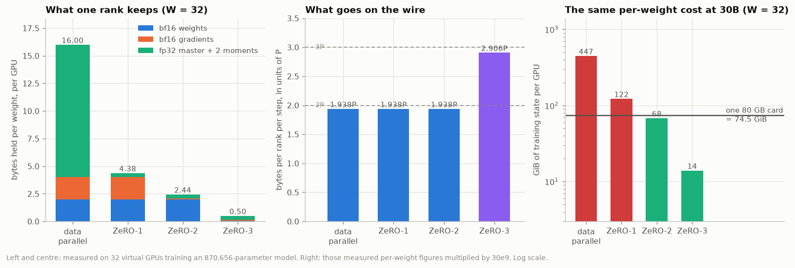

# E3 · What each stage costs

870,656 parameters (4 blocks, d_model 128, 6 groups), 32 virtual GPUs, 2 sequences each, 8,192 tokens per step, 8 steps.

## The memory, audited

Measured by a meter that is told about every tensor as it is allocated, then compared against the formula the session notes give. The two columns are computed from opposite ends and never see each other.

| arrangement   | bytes/weight measured | formula, W=32 | resident per rank | peak per rank | saving |
| ------------- | --------------------: | ------------: | ----------------: | ------------: | -----: |
| data parallel |               16.0000 |       16.0000 |         13.29 MiB |     14.66 MiB |   1.0x |
| ZeRO-1        |                4.3750 |        4.3750 |          3.63 MiB |      5.01 MiB |   3.7x |
| ZeRO-2        |                2.4375 |        2.4375 |          2.02 MiB |      3.78 MiB |   6.6x |
| ZeRO-3        |                0.5000 |        0.5000 |          0.42 MiB |      2.17 MiB |  32.0x |

Identical in every row: `memory_matches_formula: True`. At world size 8 the same audit reproduces the session's own table — 16.00, 5.50, 3.75, 2.00 — exactly (`True`).

### Where the peak actually goes

Resident state is not what fills a card. This is the largest the meter ever saw, broken out by what was holding it.

| arrangement   | weights | gradients | optimizer | grad bucket | gathered | activations | peak MiB |
| ------------- | ------: | --------: | --------: | ----------: | -------: | ----------: | -------: |
| data parallel |    1.66 |      1.66 |      9.96 |        0.75 |     0.00 |        0.62 |    14.66 |
| ZeRO-1        |    1.66 |      1.66 |      0.31 |        0.75 |     0.00 |        0.62 |     5.01 |
| ZeRO-2        |    1.66 |      0.05 |      0.31 |        1.13 |     0.00 |        0.62 |     3.78 |
| ZeRO-3        |    0.05 |      0.05 |      0.31 |        1.13 |     0.00 |        0.62 |     2.17 |

Three things are visible there that the bytes-per-weight column hides.

**The gradient buffer is 2 bytes a weight and stages 0 and 1 never get it back.** It is allocated once and zeroed between steps, exactly as PyTorch's `.grad` is, so it is resident state and not a transient. That is why ZeRO-1 bottoms out at 4 bytes a weight however many GPUs are added: 2 for the weights plus 2 for the gradients, neither of which it shards.

**Stages 2 and 3 pay a bucket instead.** They reduce-scatter each group's gradient as the backward pass produces it and drop the full-size buffer immediately, so what they hold is one group's worth at a time rather than the whole model's. The `grad bucket` column is that transient, and it is the thing DeepSpeed's `bucket_size` names — bigger buckets, fewer and more efficient transfers, more memory held at once.

**Activations do not shard at all.** Every arrangement holds the same 0.88 MiB of them, because they belong to the rank's own sequences and no other rank has a copy to share. ZeRO says nothing about activation memory; that is what activation checkpointing is for, and this model uses it — only the tensor entering each group is kept, and the rest is recomputed in the backward pass.

## The wire, counted

| arrangement   | per rank per step, measured | formula | collective calls | actual bytes |
| ------------- | --------------------------: | ------: | ---------------: | -----------: |
| data parallel |                     1.9375P | 1.9375P |                6 |      3.37 MB |
| ZeRO-1        |                     1.9375P | 1.9375P |               12 |      3.37 MB |
| ZeRO-2        |                     1.9375P | 1.9375P |               12 |      3.37 MB |
| ZeRO-3        |                     2.9062P | 2.9062P |               18 |      5.06 MB |

`wire_matches_formula: True`. Stages 1 and 2 send precisely what data parallelism sends. Stage 3 sends half as much again, and the extra half is one all-gather of the weights in the forward pass and one more in the backward — 18 calls a step against 6, because every group is now fetched twice and returned twice.

## The clock

These are threads on one laptop CPU, so the seconds below are not a prediction about a GPU cluster — 32 ranks share 10 cores, and the `in collectives` column is barrier and memcpy time, not network time. What the table *is* good for is the shape: what each arrangement does with a step, and how much of one it spends not computing.

| arrangement   | ms/step | forward+backward | AdamW | casts and copies | in collectives | share stopped |
| ------------- | ------: | ---------------: | ----: | ---------------: | -------------: | ------------: |
| data parallel |   564.5 |            278.3 |  42.7 |             10.4 |          233.1 |           41% |
| ZeRO-1        |   478.9 |            260.0 |  31.3 |             10.9 |          176.7 |           37% |
| ZeRO-2        |   480.1 |            253.6 |  30.6 |             12.2 |          183.7 |           38% |
| ZeRO-3        |   485.9 |            249.7 |  33.5 |              9.2 |          193.6 |           40% |

The four middle columns are disjoint and add to the first: time inside a collective is taken out of the phase it happened in, so stage 2's reduce-scatters are counted once, in the last column, and not again in the backward pass they interrupt.

The AdamW column is the interesting failure. The sharded stages update a thirty-second of the weights and it buys them almost nothing: 42.7 ms a step against 33.5. Timed on its own, away from the mesh, the same arithmetic behaves the way it should:

| parameters | one rank's shard (W=32) | AdamW on all, ms | AdamW on the shard, ms | speedup |
| ---------: | ----------------------: | ---------------: | ---------------------: | ------: |
|    870,656 |                  27,208 |            0.723 |                  0.031 |   23.7x |
|  8,000,000 |                 250,000 |            8.349 |                  0.201 |   41.5x |
| 64,000,000 |               2,000,000 |           65.605 |                  1.704 |   38.5x |

24x at this model's size and 38x at 64M — past 32x, because a 2M-element shard also fits in cache and a 64M-element vector does not. So the saving is real and it is large. What the 8-step run above cannot show is *this machine*: 32 Python threads on 10 cores, where a tensor operation on 27,000 numbers spends its time in dispatch — holding the interpreter lock — rather than in arithmetic. The ranks queue behind each other no matter how small their shards get.

That is the honest boundary of this simulator and it is worth stating plainly: **the bytes it reports are exact and the seconds it reports are about a laptop.** Memory per rank and traffic per step are counted, not modelled, and they would be the same numbers on 32 H100s. Wall-clock is not, which is why experiment 5 prices the time from the byte counts and a stated bandwidth instead of from this machine's clock.

Thirty-one of every thirty-two of data parallelism's updates are a computation the other ranks are performing at the same moment on the same inputs. *That* is the redundancy the **O** in Zero Redundancy Optimizer names, and it is the one saving in this session that costs nothing at all: the sharded stages do less arithmetic, not merely less storing.

## The same per-weight figures, at 30 billion

Nothing here is re-derived. The measured bytes-per-weight from the first table, multiplied by 30e9, against a card that holds 74.5 GiB.

| arrangement   | bytes/weight | state per GPU | on an 80 GB card | wire per step | NVLink | InfiniBand |
| ------------- | -----------: | ------------: | ---------------- | ------------: | -----: | ---------: |
| data parallel |      16.0000 |     447.0 GiB | does not fit     |        116 GB | 0.26 s |     2.33 s |
| ZeRO-1        |       4.3750 |     122.2 GiB | does not fit     |        116 GB | 0.26 s |     2.33 s |
| ZeRO-2        |       2.4375 |      68.1 GiB | fits             |        116 GB | 0.26 s |     2.33 s |
| ZeRO-3        |       0.5000 |      14.0 GiB | fits             |        174 GB | 0.39 s |     3.49 s |

At 32 GPUs, on the training state alone: data parallelism needs 447 GiB a card and ZeRO-1 needs 122 GiB, and a card has 74.5. ZeRO-2 fits with 6.4 GiB to spare, which has to cover activations, and ZeRO-3 fits with room to spare on far fewer GPUs. Experiment 4 walks the world size to find where each line crosses.

