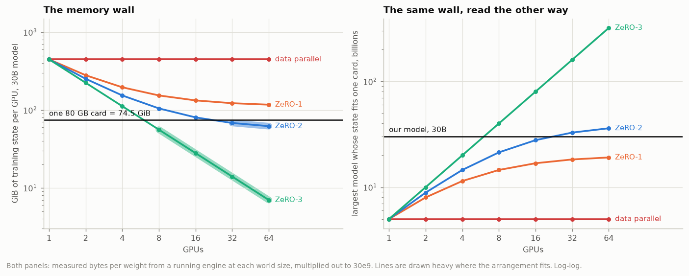

# E4 · The memory wall, one virtual GPU to sixty-four

Every cell below comes from an engine that ran. The world size on the left is a real number of threads, each holding real tensors, and the meter counted them.

## Bytes per weight, measured

| arrangement   |    W=1 |    W=2 |    W=4 |    W=8 |   W=16 |   W=32 |   W=64 |
| ------------- | -----: | -----: | -----: | -----: | -----: | -----: | -----: |
| data parallel | 16.000 | 16.000 | 16.000 | 16.000 | 16.000 | 16.000 | 16.000 |
| ZeRO-1        | 16.000 | 10.000 |  7.000 |  5.500 |  4.750 |  4.375 |  4.188 |
| ZeRO-2        | 16.000 |  9.000 |  5.500 |  3.750 |  2.875 |  2.438 |  2.219 |
| ZeRO-3        | 16.000 |  8.000 |  4.000 |  2.000 |  1.000 |  0.500 |  0.250 |

Against the formula, in all 28 cells: `measured_matches_formula: True`.

Read the rows rather than the columns and the session's argument appears on its own:

- **Data parallelism is flat.** 16.000 at every world size. Buying GPUs buys throughput and nothing else; each one still holds the entire model, the entire gradient and the entire optimizer state.
- **ZeRO-1 approaches 4 and stops.** It shards the twelve bytes of optimizer state and leaves the 2-byte weights and 2-byte gradients replicated. 4.375 at W=32, 4.188 at W=64, 4.000 in the limit.
- **ZeRO-2 approaches 2 and stops**, for the same reason with one fewer term: the weights are still replicated.
- **ZeRO-3 has no floor.** 16/W, all the way down. It is the only arrangement where adding a GPU reduces what every GPU holds.

## The same rows at 30 billion parameters

Measured bytes per weight × 30e9, against a card that holds 74.5 GiB. Cells in bold fit.

| arrangement   | 1 GPU | 2 GPUs | 4 GPUs |   8 GPUs |  16 GPUs |  32 GPUs |  64 GPUs |
| ------------- | ----: | -----: | -----: | -------: | -------: | -------: | -------: |
| data parallel | 447.0 |  447.0 |  447.0 |    447.0 |    447.0 |    447.0 |    447.0 |
| ZeRO-1        | 447.0 |  279.4 |  195.6 |    153.7 |    132.7 |    122.2 |    117.0 |
| ZeRO-2        | 447.0 |  251.5 |  153.7 |    104.8 |     80.3 | **68.1** | **62.0** |
| ZeRO-3        | 447.0 |  223.5 |  111.8 | **55.9** | **27.9** | **14.0** |  **7.0** |

| arrangement   | fits an 80 GB card from | largest model at W=32 |
| ------------- | ----------------------: | --------------------: |
| data parallel |                   never |                  5.0B |
| ZeRO-1        |                   never |                 18.3B |
| ZeRO-2        |                 32 GPUs |                 32.8B |
| ZeRO-3        |                  8 GPUs |                160.0B |

## Why two of the rows never fit

Not because 30 billion is a large number — because of what stays replicated. Data parallelism and ZeRO-1 both keep the 2-byte weights and the 2-byte gradients on every card. That is 4 bytes a weight that no world size touches, and 4 bytes a weight has a model size attached to it:

|                                                   |           |
| ------------------------------------------------- | --------: |
| a card                                            |  74.5 GiB |
| replicated bytes per weight (weights + gradients) |         4 |
| parameters that fill the card                     |     20.0B |
| our model                                         |       30B |
| what it needs, at 4 bytes a weight                | 111.8 GiB |

**20.0 billion parameters is the boundary**, and it is a property of the arrangement rather than of the hardware budget. A 20B model sits on the line; ours sits 1.5x past it. Every thousand-GPU cluster in the world is still short of a card for it under ZeRO-1.

## What the table is not counting

Training state only. The activations are extra, they belong to the rank's own sequences, and no ZeRO stage shards them — this run measured 0.44 MiB of them per rank for 1 sequence of 128 tokens, *with* checkpointing already on. A real V5 micro-batch is far larger and the activation term with it, so the ZeRO-2 row's 68.1 GiB at 32 GPUs is not a configuration that fits — it is a configuration with 6.4 GiB left for everything else, which is not enough. Read the fitted cells as an upper bound on what is possible, not as a plan.

