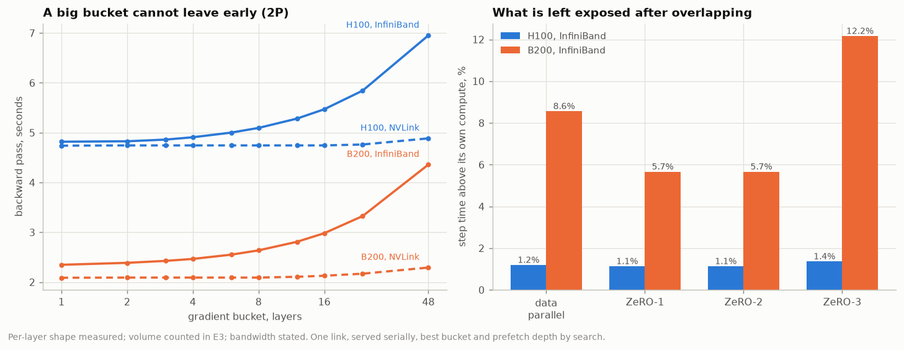

# E5 · Communication that happens during computation costs nothing

## The profile the simulation runs on

A 12-block model, one thread, nothing else running, timestamped at every group boundary in both directions.

| group                 | parameters | forward ms | backward ms | share of the backward |
| --------------------- | ---------: | ---------: | ----------: | --------------------: |
| group 0  (embeddings) |     49,152 |       0.04 |        0.13 |                  0.7% |
| group 1  (block)      |    197,120 |       0.51 |        1.40 |                  8.1% |
| group 2  (block)      |    197,120 |       0.51 |        1.40 |                  8.1% |
| group 12  (block)     |    197,120 |       0.51 |        1.44 |                  8.3% |
| group 13  (head)      |     33,024 |       0.04 |        0.32 |                  1.9% |

The whole backward is 2.82x the whole forward here, against the 2x that 6N FLOPs a token predicts, because this repository's backward recomputes each group's activations before differentiating them and so carries the forward's work a second time. The projection below uses the 2x, not the 2.82x, because the cluster step times it starts from are for a production step and recomputation is a choice that step may not have made. Assuming the smaller backward is the conservative direction: a longer backward is a longer window to hide transfers in.

The blocks cost the same as each other and the two ends do not. That shape is what is carried over to a 48-block, 30-billion-parameter model; nothing else about this machine is. The *time* comes from the step times a real cluster reports, the *volume* from experiment 3's byte counts, and a step is taken to be one third forward and two thirds backward, because a step is 6N FLOPs a token and the backward is 4 of them.

## Without overlap

Everything sent after the pass that produced it, at 30B and world size 32.

| arrangement   | card      | wire       | volume | wire time | ÷ compute | step, serial |
| ------------- | --------- | ---------- | -----: | --------: | --------: | -----------: |
| data parallel | 64 x H100 | NVLink     |  1.94P |    0.26 s |        4% |       7.36 s |
| ZeRO-3        | 64 x H100 | NVLink     |  2.91P |    0.39 s |        5% |       7.49 s |
| data parallel | 64 x H100 | InfiniBand |  1.94P |    2.33 s |       33% |       9.43 s |
| ZeRO-3        | 64 x H100 | InfiniBand |  2.91P |    3.49 s |       49% |      10.59 s |
| data parallel | 64 x B200 | NVLink     |  1.94P |    0.26 s |        8% |       3.38 s |
| ZeRO-3        | 64 x B200 | NVLink     |  2.91P |    0.39 s |       12% |       3.51 s |
| data parallel | 64 x B200 | InfiniBand |  1.94P |    2.33 s |       75% |       5.45 s |
| ZeRO-3        | 64 x B200 | InfiniBand |  2.91P |    3.49 s |      112% |       6.61 s |

The 2P-over-InfiniBand rows are the session's own figures — 33% on H100 and 75% on B200. The volume did not change between those two rows. The compute it has to hide behind got shorter, and that is the entire reason faster cards make this harder.

## The bucket sweep

Data parallelism's 2P, sent during a backward pass that is 0.67 of the step. 48 blocks, so a bucket of 1 is 50 transfers and a bucket of 48 is two.

| bucket, layers | transfers | backward pass | exposed tail | hidden |
| -------------: | --------: | ------------: | -----------: | -----: |
|              1 |        50 |       4.818 s |      0.085 s |    96% |
|              2 |        25 |       4.827 s |      0.094 s |    96% |
|              3 |        17 |       4.861 s |      0.127 s |    95% |
|              4 |        13 |       4.907 s |      0.174 s |    93% |
|              6 |         9 |       5.001 s |      0.268 s |    88% |
|              8 |         7 |       5.095 s |      0.361 s |    84% |
|             12 |         5 |       5.282 s |      0.549 s |    76% |
|             16 |         4 |       5.469 s |      0.736 s |    68% |
|             24 |         3 |       5.844 s |      1.110 s |    52% |
|             48 |         2 |       6.952 s |      2.218 s |     5% |

*(64 × H100 over InfiniBand: a 4.73 s backward window carrying 2.33 s of traffic.)*

The cost of a large bucket is not the transfer, it is *when* the transfer can start. A 48-layer bucket cannot leave until the backward pass has reached layer 0, so all of it is exposed; a 1-layer bucket leaves as each layer finishes and only the last one — the embedding, which is small — is left over at the end.

## Where the smallest bucket stops being the best one

At a 10 µs launch cost the smallest bucket always wins, which is not what production settings look like. The optimum is set by the ratio of the fixed cost of a transfer to the time the bytes themselves take, so the honest thing is to sweep the fixed cost and find the crossover rather than to assert a bucket size. B200, InfiniBand, 2P:

| fixed cost per transfer | best bucket, layers | backward pass | at bucket = 1 |
| ----------------------: | ------------------: | ------------: | ------------: |
|                 0.01 ms |                   1 |       2.347 s |       2.347 s |
|                  0.1 ms |                   1 |       2.352 s |       2.352 s |
|                    1 ms |                   1 |       2.396 s |       2.396 s |
|                    5 ms |                   2 |       2.506 s |       2.592 s |
|                   10 ms |                   3 |       2.591 s |       2.837 s |
|                   25 ms |                   6 |       2.775 s |       3.585 s |
|                   50 ms |                   8 |       2.986 s |       4.835 s |

The crossover is at about 5.0 ms of fixed cost per transfer. Below it, start transfers as early as possible; above it, the launch cost of 50 transfers outweighs the earlier start and the bucket should grow. A production `bucket_size` of a few hundred megabytes is a bet about which side of that line the cluster is on — and the V4 configuration in the session notes bet 2e8 bytes.

## The whole step, all four arrangements

Both windows, each with the best bucket and prefetch depth found by search. `overhead` is how much longer the step is than its own compute.

| arrangement   | card      | wire       | on the wire | exposed | hidden |   step | overhead |
| ------------- | --------- | ---------- | ----------: | ------: | -----: | -----: | -------: |
| data parallel | 64 x H100 | NVLink     |      0.26 s |  0.01 s |    98% | 7.11 s |    +0.1% |
| ZeRO-1        | 64 x H100 | NVLink     |      0.26 s |  0.01 s |    98% | 7.11 s |    +0.1% |
| ZeRO-2        | 64 x H100 | NVLink     |      0.26 s |  0.01 s |    98% | 7.11 s |    +0.1% |
| ZeRO-3        | 64 x H100 | NVLink     |      0.39 s |  0.01 s |    98% | 7.11 s |    +0.1% |
| data parallel | 64 x H100 | InfiniBand |      2.33 s |  0.08 s |    96% | 7.18 s |    +1.2% |
| ZeRO-1        | 64 x H100 | InfiniBand |      2.33 s |  0.08 s |    97% | 7.18 s |    +1.1% |
| ZeRO-2        | 64 x H100 | InfiniBand |      2.33 s |  0.08 s |    97% | 7.18 s |    +1.1% |
| ZeRO-3        | 64 x H100 | InfiniBand |      3.49 s |  0.10 s |    97% | 7.20 s |    +1.4% |
| data parallel | 64 x B200 | NVLink     |      0.26 s |  0.01 s |    97% | 3.13 s |    +0.2% |
| ZeRO-1        | 64 x B200 | NVLink     |      0.26 s |  0.01 s |    98% | 3.13 s |    +0.2% |
| ZeRO-2        | 64 x B200 | NVLink     |      0.26 s |  0.01 s |    98% | 3.13 s |    +0.2% |
| ZeRO-3        | 64 x B200 | NVLink     |      0.39 s |  0.01 s |    98% | 3.13 s |    +0.2% |
| data parallel | 64 x B200 | InfiniBand |      2.33 s |  0.27 s |    89% | 3.39 s |    +8.6% |
| ZeRO-1        | 64 x B200 | InfiniBand |      2.33 s |  0.18 s |    92% | 3.30 s |    +5.7% |
| ZeRO-2        | 64 x B200 | InfiniBand |      2.33 s |  0.18 s |    92% | 3.30 s |    +5.7% |
| ZeRO-3        | 64 x B200 | InfiniBand |      3.49 s |  0.38 s |    89% | 3.50 s |   +12.2% |

Three readings.

**Inside a node, everything hides.** Every NVLink row is within a per cent of its own compute time, stage 3 included. A run whose traffic stays inside one node barely has a communication cost at all, which is the answer to the session's second open question: put as much of the traffic inside a node as will fit.

**Between nodes, the split matters more than the total.** Data parallelism and ZeRO-1 move the same 2P on 64 x B200, and data parallelism pays 8.6% for it against ZeRO-1's 5.7%. The reason is not volume, it is *windows*: data parallelism has to push all 2P through the backward pass, while ZeRO-1 and ZeRO-2 put one P in the backward and the other in the next forward, where there is compute going spare. Sharding the optimizer state bought a better communication schedule as well as the memory.

**Stage 3 is the one that runs out of window.** It has 3P to move and, on 64 x B200 over InfiniBand, a step of 3.12 s to hide 3.49 s of traffic in — and 0.15 s of its backward pass is spent standing still waiting for weights that have not arrived. That is the practical form of the 2P-versus-3P difference, and it is the argument for keeping a stage 3 group inside one node.

