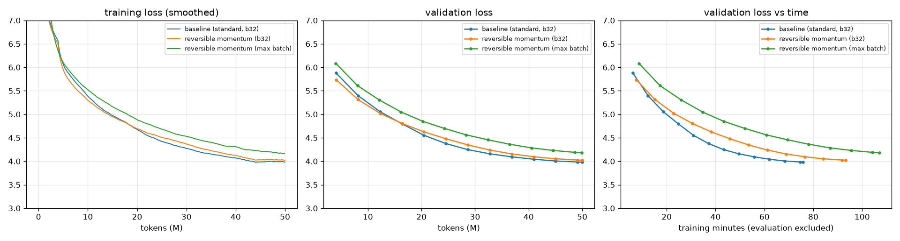
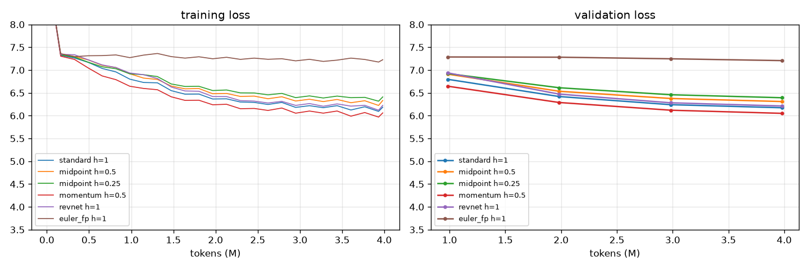
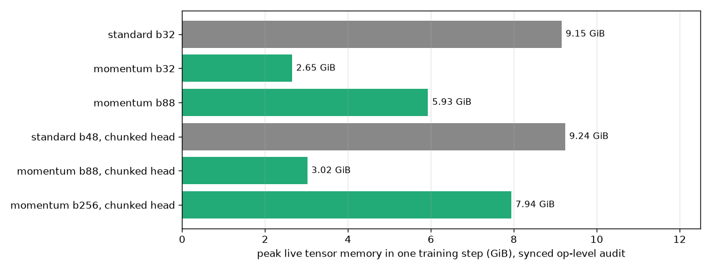

# A 20M GPT trained three times, the last two without storing its activations

**ERA V5 · Session 13 · Distributed Training II — Reversibility**

A 21.05M-parameter GPT trained on 50M tokens of FineWeb-Edu three times: once as an ordinary
transformer, once with a reversible residual stream at the same batch, and once with the reversible
stream pushed to the largest batch the machine could hold. Before those runs, a screen of five
reversible rules picked which one to use, and it found one that does not work at all.

- **Repo:** https://github.com/amukka/ERA_V5/tree/main/session13_Distributed_Training
- **Notebooks** (executed, with their outputs): [`01_variant_screen`](01_variant_screen.ipynb) ·
  [`02_baseline`](02_baseline.ipynb) · [`03_reversible`](03_reversible.ipynb) ·
  [`04_reversible_max_batch`](04_reversible_max_batch.ipynb) · [`05_report`](05_report.ipynb) ·
  [`06_head_bottleneck`](06_head_bottleneck.ipynb)
- **Evidence:** [`results/`](results/): every run's step log (`runs/*.jsonl`) and summary (`runs/*.json`),
  the screen, the max-batch searches, the memory audit and the figures
- **Machine:** Apple M4 (10-core GPU, 16 GB unified memory, MPS cap 11.84 GiB), torch 2.13.0, Python 3.14,
  fp32. The notebooks also run on Colab: the setup cell clones the repo and builds the data, and on CUDA
  the memory meter uses the exact `torch.cuda.max_memory_allocated()`.

Every number below was produced by the code in this directory on that machine.

---

## The answer

| run | batch | steps | final train loss | final val loss | tokens/s | train time | peak memory | vs baseline: speed | vs baseline: memory |
|---|---:|---:|---:|---:|---:|---:|---:|---:|---:|
| **1 · baseline**, standard GPT | 32 | 3,051 | 3.976 | **3.980** | **10,983** | 75.8 min | 9.15 GiB | 1.00x | 1.00x |
| **2 · reversible** (momentum, h = 0.5), same batch | 32 | 3,051 | 4.014 | **4.021** | **8,925** | 93.3 min | **2.65 GiB** | 0.81x | **0.29x** |
| **3 · reversible, maximum batch** | **88** | 1,109 | 4.162 | **4.181** | **7,776** | 107.0 min | 5.93 GiB | 0.71x | 0.65x |

- **Tokens:** every run trains on the same 50M tokens (97,657 rows of 512 tokens), in the same order.
- **Final train loss:** the mean over the last 5% of logged steps.
- **Final val loss:** 40 batches of 16 × 512 held-out tokens.
- **Tokens/s:** training tokens per second of training wall-clock, with evaluation excluded. The
  median over logging intervals agrees to within 0.2% (10,994 / 8,920 / 7,778).
- **Peak memory:** the live-tensor peak of one training step. It comes from an op-by-op audit with the
  GPU synchronised after every op, and it repeats to within 0.3% ([below](#4-measuring-peak-memory-on-mps)).

**Which reversible variant worked:** the **momentum rule, a symplectic (semi-implicit) Euler step on a
position/velocity pair, with h = 0.5**. Midpoint (leapfrog) and RevNet coupling also worked: their
gradients were exact and they trained normally, but more slowly. **Plain Euler did not work**: made
reversible by fixed-point inversion, it could not learn. See [section 1](#1-which-reversible-rule).



---

## The model and the data

| | |
|---|---|
| model | GPT, 10 layers, d_model 384, 6 heads, MLP 4×, sequence length 512, pre-LayerNorm, learned positions, head tied to the embedding |
| parameters | **21,053,184** (17,710,848 outside the embedding tables) |
| tokenizer | byte-level BPE, vocabulary 8,192, trained on the first 60k documents of the stream ([`data/tokenizer.json`](data/tokenizer.json)) |
| data | `HuggingFaceFW/fineweb-edu`, `sample-10BT`, streamed in order: 56M training tokens from 46,080 documents, 1M validation tokens, 3.89 characters per token ([`data/meta.json`](data/meta.json)) |
| optimiser | AdamW (0.9, 0.95), weight decay 0.1, peak LR 1e-3, 3% warmup, cosine to 10%, gradient clip 1.0 |
| precision | fp32. bf16 autocast was measured *slower* on the M4 (10.1k vs 11.0k tokens/s for the standard model), so it is off |
| dropout | none. A reversible backward pass recomputes each block, and a random mask would recompute differently |

**The fixed batch is 32 × 512 = 16,384 tokens a step.** It is the largest batch the standard model
trains at on this machine: the max-batch search finds 32 fits and 36 does not.

**The data order is fixed across batch sizes.** The training file is cut into rows of 513 tokens and
shuffled once with a fixed seed. Step *k* at batch *B* takes rows [*kB*, (*k*+1)*B*). So runs 1–3 read
the same text in the same order, grouped differently.

---

## 1. Which reversible rule

The block function is the same everywhere: `f(p) = a + mlp(ln2(p + a))` with `a = attn(ln1(p))`. With
that definition, `p + f(p)` is exactly a GPT-2 block, and every variant has exactly the same 21.05M
weights. Only the rule that moves the residual stream from layer to layer changes.

| rule | forward | how the backward pass gets the layer input back |
|---|---|---|
| standard | `p' = p + f(p)` | it doesn't; autograd stores every activation |
| **midpoint** (leapfrog, §16) | `p[l+1] = p[l-1] + 2h·f(p[l])` | exact: `p[l-1] = p[l+1] − 2h·f(p[l])` |
| **momentum** (symplectic Euler) | `v' = v + h·f(x)`, `x' = x + h·v'` (v starts at 0) | exact: `x = x' − h·v'`, then `v = v' − h·f(x)` |
| **revnet** (additive coupling) | `y1 = x1 + A(x2)`, `y2 = x2 + M(y1)` | exact: `x2 = y2 − M(y1)`, `x1 = y1 − A(x2)` |
| **euler_fp** | `p' = p + h·f(p)`, the standard network | solve `p = p' − h·f(p)` by 6 rounds of fixed-point iteration |

All four reversible rules run their stack inside one `torch.autograd.Function`
([`src/model.py`](src/model.py)). Its forward pass runs under `no_grad` and saves only the final state.
Its backward pass walks down the layers. At each layer it rebuilds the input from the output, re-runs
that one block with grad enabled and takes the vector–Jacobian product. Each block is evaluated once in
the forward pass and once in the backward pass, which is the "one extra forward" the notes price at
30–50%.

### First, the algebra, in float64

[`tests/test_reversible.py`](tests/test_reversible.py) compares two gradients for each rule. One comes
from the reversible backward, which stores nothing. The other comes from plain autograd over the same
forward rule, which stores everything. The test uses a tiny model with its weights deliberately large
(std 0.15), so that the blocks are far from the identity.

| rule | gradient relative error | largest error in a rebuilt state |
|---|---:|---:|
| midpoint | 2.1e-13 | 8.0e-15 |
| momentum | 8.1e-14 | 8.9e-15 |
| revnet | 7.4e-14 | 5.9e-15 |
| euler_fp, h = 1, 6 iterations | **0.89** | **3.1** |
| euler_fp, h = 1, 30 iterations | 0.89 | 3.7 |

The three exact rules are correct to the last bits of float64. The Euler inversion is not an
approximation that more iterations improve: 30 rounds are no better than 6. The iteration
`p ← p' − h·f(p)` converges only when `h·f` is a contraction, and a transformer block has no reason to
be one.

### Then, the screen: 4M tokens each, batch 32

The screen uses the same data, seed and schedule, compressed to 4M tokens. Each run ends by checking,
at its own trained weights in fp32 on the GPU, how far the reversible gradient is from autograd's.

| rule | val loss @ 4M | tokens/s | gradient cosine to autograd | rebuilt-state error (relative) |
|---|---:|---:|---:|---:|
| standard | 6.173 | 10.5k (median)¹ | — | — |
| midpoint, h = 0.5 | 6.309 | 8,555 | 0.9999999996 | 5.9e-05 |
| midpoint, h = 0.25 | 6.393 | 8,660 | 0.99999999993 | 3.7e-05 |
| **momentum, h = 0.5** | **6.051** | 8,539 | 0.99999999992 | 2.8e-06 |
| revnet | 6.211 | 8,918 | 0.9999999993 | 8.9e-07 |
| euler_fp, h = 1 | **7.207** | 4,538 | **0.069** | **1.77** |

¹ The standard screen run's mean was 6,367 tokens/s, because the machine swapped during its last 30
steps; every other logging interval ran at 10.0–11.0k tokens/s.



**What the screen shows:**

- **Euler with fixed-point inversion does not train.** Its loss stops at about 7.2 after the first
  0.2M tokens and stays there. By the end, the rebuilt layer inputs are off by 177% of the state's size,
  and the gradient it follows has a cosine of 0.07 with the true one. That is close to a random
  direction. It is also the slowest rule (4.5k tokens/s), because every layer runs 7 block evaluations
  in the backward pass instead of 1. This is the concrete reason §16 says the ordinary residual rule
  "cannot be reversed".
- **Midpoint works exactly and trains, but behind the standard model at 4M tokens**, and it gets worse
  as h shrinks: 6.31 at h = 0.5 and 6.39 at h = 0.25. A smaller step makes each layer's update smaller,
  and at this depth and budget the stack learns more slowly.
- **Momentum was the best of the five at 4M tokens (6.05, below the standard model's 6.17)** and was
  chosen for the 50M-token runs. It is selected automatically in notebook 01 as the reversible rule
  with the lowest validation loss whose gradient cosine is above 0.9999.
- **Exact rules stay exact in fp32 on MPS.** Gradient cosines are ≥ 0.9999999993, and rebuilt states
  are within 1e-4 relative.

---

## 2. Runs 1 and 2: the same work, with and without stored activations

| | baseline | reversible (momentum) | ratio |
|---|---:|---:|---:|
| final val loss | 3.980 | 4.021 | +0.041 |
| tokens/s | 10,983 | 8,925 | **0.81x** |
| time for 50M tokens | 75.8 min | 93.3 min | 1.23x |
| peak memory of a step | 9.15 GiB | **2.65 GiB** | **0.29x** |
| Metal driver peak (allocator cache included) | 11.56 GiB | 6.07 GiB | 0.53x |
| op at the peak | cross-entropy backward | cross-entropy backward | |

**Memory: 3.5 times less at the same batch.** The standard stack keeps ten layers of activations alive
until the backward pass reaches them. The reversible stack keeps the final state (x, v) and one layer's
working set.

**Speed: the recompute costs 23% more time per token.** That is under the 30–50% the paper estimates.
The extra forward is a smaller fraction of a step here because the 8,192-way output head, which is not
recomputed, is a large share of a step at this size.

**Loss: the reversible model leads, then trails.** The momentum model is ahead for the first ~12M
tokens (5.74 vs 5.88 at 4M, 5.31 vs 5.40 at 8M). The curves cross at 16M (4.805 vs 4.798), and the
baseline finishes 0.04 lower. These are not the same function class with a different backward pass.
Momentum is a different network: it is second order in depth, and its velocity starts at zero. On this
budget it is slightly worse at the end. The gradient it trains with is correct: at the final weights the
reversible gradient has a cosine of 0.999999995 with autograd's for that network.

**The rebuild error grows with training but stays small.** The largest relative error in a rebuilt state
was 5.3e-06 at initialisation and 2.9e-05 after 50M tokens. It is largest at layer 1, the last one
rebuilt, because the error accumulates as the backward pass walks down the stack.

---

## 3. Run 3: the maximum batch, and what sets it

### The ceiling

Each candidate batch trains 4 steps in a fresh process, with the MPS allocator capped at the
recommended working set (11.84 GiB), so running out of memory is a clean failure instead of swap. The
search doubles the batch until it fails, then bisects ([notebook 04](04_reversible_max_batch.ipynb)).

| stack | fits | does not fit | **max batch** |
|---|---|---|---:|
| standard | 32 | 36, 40, 48, 64 | **32** |
| momentum (reversible) | 32, 64, 80, 88 | 96, 128 | **88** |

**2.75x the batch, not the ~10x the paper reports.** The reason is in the op at the peak.

### After reversibility, the output head is the wall

From the synced audit, the reversible stack's step peak grows by **(6,073 − 2,716) / 56 = 60 MiB per
extra sequence**. One fp32 logits tensor for one sequence is 512 × 8,192 × 4 bytes = **16 MiB**, and the
loss holds several of them at once: the logits, the log-softmax, and its gradient. Nearly all of the 60
MiB is the head, which reversibility does nothing about. The standard stack costs about **280 MiB per
sequence** (9.15 GiB at 32 sequences, less 0.32 GiB of weights, gradients and AdamW state). So
reversibility removed about 80% of the per-sequence cost, and the head is most of what is left.

[Notebook 06](06_head_bottleneck.ipynb) changes one thing to test that. The head and loss are computed
8 sequences at a time and recomputed in the backward pass (`--loss-chunk 8`), which gives a gradient
identical to the plain head to 2e-16 in float64.

| stack | max batch, plain head | max batch, chunked head |
|---|---:|---:|
| standard | 32 | 48 |
| momentum | 88 | **256** |
| ratio | 2.75x | **5.33x** |

With the head chunked, the reversible stack's per-sequence cost drops to **(8,132 − 3,090) / 168 =
30 MiB**. The peak moves out of the loss and into `_softmax_backward_data`, the attention softmax of
the one layer being rebuilt. MPS's attention materialises the 6 × 512 × 512 score matrix (6 MiB per
sequence per copy). The standard stack gains less (32 → 48) because its ten layers of stored
activations are still there.

### The Metal driver, not the live tensors, hits the cap

At batch 88, the live tensors peak at 5.93 GiB, while the Metal driver has handed the process 11.28 GiB
out of the 11.84 GiB cap. The same pattern holds at 256 with the chunked head (7.94 GiB live). The
caching allocator's reserve, fragmentation and buffers still owned by in-flight command buffers roughly
double what a step needs. The live-tensor peak is what the method controls; the driver total is what
decides the ceiling.

### Training at the ceiling

Run 3 trains the same 50M tokens at batch 88: 45,056 tokens a step and 1,109 steps. The peak LR is
scaled by √(88/32) to 1.66e-3, with 5% warmup.

| | run 2 (b32) | run 3 (b88) |
|---|---:|---:|
| optimizer steps | 3,051 | 1,109 |
| final val loss | 4.021 | 4.181 |
| tokens/s | 8,925 | 7,776 |

**On this GPU the maximum batch is a capacity result, not a speed-up.** Throughput *fell* with batch:
9.0k tokens/s at 64 and 7.8k at 88 in the probes. The M4's GPU is already saturated at batch 32, so a
bigger batch adds memory traffic without adding utilisation. The loss is worse for the same tokens
because the run takes 2.75 times fewer optimizer steps. The paper's throughput gain (114 vs 57 samples/s)
came from GPUs where a small batch leaves compute idle, and that is not the situation here. What the
larger batch *does* buy is the headroom §17 describes. It is the same model at 2.75x (or, with the
chunked head, 5.3x) the batch, or equivalently at a proportionally longer sequence, in the same memory.

---

## 4. Measuring peak memory on MPS

MPS has no `max_memory_allocated()`. [`src/memory.py`](src/memory.py) measures the peak two ways:

1. **During training:** it samples `current_allocated_memory()` and `driver_allocated_memory()` after
   the forward pass, once per layer in the backward pass (a tensor hook for the standard stack, inside
   the reversible backward for the others), and after the optimizer step. This gives a lower bound,
   because it misses peaks between samples.
2. **Audit:** a `TorchDispatchMode` samples after *every* aten op, forward and backward, for one step.

The first version of the audit was not repeatable. The two midpoint screen runs, identical apart from
h, read 3.71 and 2.80 GiB, and batch 88 read 8.16 GiB in its probe but 6.35 GiB in its run. MPS keeps a
freed buffer counted until the command buffer using it completes, so an unsynchronised reading depends
on how far the GPU lags the CPU. Synchronising after every op fixed it. [`src/memory_audit.py`](src/memory_audit.py)
meters two steps per configuration, and they agree to within 0.3% ([`results/memory_audit.json`](results/memory_audit.json)):

| configuration | step 3 | step 4 | op at the peak |
|---|---:|---:|---|
| standard b32 | 9,370.5 MiB | 9,370.5 MiB | `_log_softmax_backward_data` |
| momentum b32 | 2,715.7 MiB | 2,715.7 MiB | `_log_softmax_backward_data` |
| momentum b88 | 6,072.9 MiB | 6,073.3 MiB | `_log_softmax_backward_data` |
| standard b48, chunked head | 9,458.7 MiB | 9,458.7 MiB | `_log_softmax_backward_data` |
| momentum b88, chunked head | 3,089.6 MiB | 3,079.8 MiB | `_softmax_backward_data` |
| momentum b256, chunked head | 8,131.6 MiB | 8,131.6 MiB | `_softmax_backward_data` |



The results table uses these synced values. The runs' own unsynced audits (9,372 / 2,755 / 6,354 MiB)
are kept in `runs/*.json` as `peak_exact_mib`.

---

## Other findings

- **bf16 is slower than fp32 on the M4** (10.1k vs 11.0k tokens/s, standard model, batch 32), though it
  uses less memory. Without tensor cores to feed, the casts are pure overhead.
- **The step size matters for midpoint.** h = 0.25 (the Lightning LM setting) trained worse than h = 0.5
  at this depth. The notes' warning that these rules are only marginally stable did not show up: no
  exact rule diverged at LR 1e-3, and momentum did not diverge at 1.66e-3.
- **Reversibility moves the bottleneck exactly as §17 says, only sooner.** The notes say the training
  state becomes the binding term. For a 21M model with an 8,192-token vocabulary, the logits become
  binding first: 16 MiB per sequence per copy, against 0.32 GiB of total training state.
- **Swap shows up as throughput.** The machine swapped briefly during the standard screen run and
  throughput fell from 10.5k to 0.9k tokens/s for 30 steps. The results table reports the mean and the
  median over logging intervals side by side, so a dip like that would be visible. None occurred in the
  three 50M-token runs.

---

## Reproduce

```bash
python -m venv .venv && source .venv/bin/activate
pip install -r requirements.txt
python tools/prepare_data.py                 # ~5 min: stream FineWeb-Edu, train the BPE, write data/*.bin
python -m tests.test_reversible              # float64 gradient check of every reversible rule
python tools/build_notebooks.py --run 01 02 03 04 06 05   # the whole session, ~7 h on an M4
python -m src.memory_audit                   # the synced peak-memory table, ~20 min
```

A single run from the command line:

```bash
python -m src.train --variant momentum --h 0.5 --batch 32 --tokens 50000000 --name my_run
```

## Files

```
src/model.py          the GPT, the five residual rules, the reversible autograd.Function, the chunked head
src/train.py          one training run: schedule, logging, throughput, memory meter, reversibility check
src/memory.py         sampled peak meter, and the op-level audit (optionally synchronised)
src/memory_audit.py   the synced two-step audit behind the memory table
src/diagnostics.py    reversible gradient vs autograd, and rebuilt vs forward states, at trained weights
src/experiments.py    what the notebooks call: the screen list, the batch probe and search
src/data.py           fixed row order shared by every batch size
tools/prepare_data.py data download, tokenizer, token files
tools/build_notebooks.py  writes and executes the notebooks
tests/test_reversible.py  float64 gradient equivalence
results/              runs/, screen, max_batch*, memory_audit, summary, figures
```
