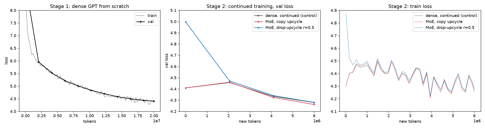
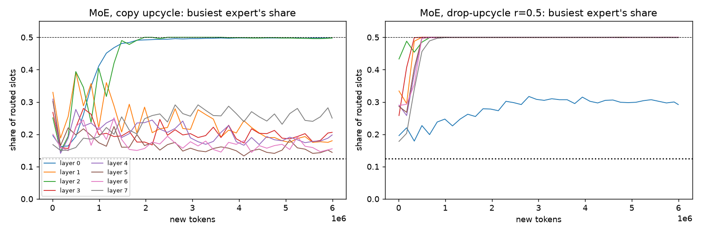

# Train a dense GPT, then convert it into a Mixture-of-Experts and keep training

**ERA V5 · Session 14 · Mixture-of-Experts**

A 17.4M-parameter dense GPT is trained from scratch on FineWeb-Edu, then every feed-forward block is
**upcycled** into 8 experts with a top-2 router, and training continues on new text. The converted model
starts at exactly the dense model's loss and keeps going down.

- **Repo:** https://github.com/amukka/ERA_V5/tree/main/session14
- **Training logs:** [`results/runs/*.jsonl`](results/runs/) (one line per 20 steps and per evaluation, with per-layer
  expert load), [`results/logs/*.log`](results/logs/) (console output of each stage), summaries in `results/runs/*.json`
- **Machine:** Apple M4, MPS, fp32, torch 2.13. One seed per run.

## What was run

| stage | what | tokens | log |
|---|---|---:|---|
| 1 | dense GPT from scratch (8 layers, d=384, 6 heads, seq 256, 17.4M params) | 20M | [`1_dense`](results/logs/1_dense.log) |
| 2 | **lossless check**: dense vs. upcycled model on the same batch, before any training | – | [`2_check_lossless`](results/logs/2_check_lossless.log) |
| 3 | control: keep training the dense model | +6M | [`3_dense_continued`](results/logs/3_dense_continued.log) |
| 4 | **MoE by copy upcycling**: 8 experts = 8 copies of each MLP, top-2 | +6M | [`4_moe_copy`](results/logs/4_moe_copy.log) |
| 5 | **MoE by drop-upcycling** (r = 0.5): as 4, but half of each copy's neurons redrawn (expert 0 stays exact) | +6M | [`5_moe_drop`](results/logs/5_moe_drop.log) |

Stages 3, 4 and 5 start from the same checkpoint, read the same new rows in the same order, and use the same
schedule (peak LR 5e-4, 50 warm-up steps, cosine to 10%), so they are directly comparable. The data is the
50M-token FineWeb-Edu shard built in Session 13 (8,192-token vocabulary); stage 1 uses the first 20M tokens and
stages 3-5 the next 6M, which the dense model never saw.

### How the conversion works ([`src/model.py`](src/model.py), `upcycle`)

- Attention, embeddings and norms are copied unchanged. Each MLP becomes `MoE`: a linear router (d_model → 8) and
  8 experts, each a copy of the original MLP.
- The router keeps the top-2 scores and **softmax-normalises only those two**, so the gates always sum to 1. If
  all experts are equal, the layer returns exactly the dense MLP whatever the router says, so the swap is lossless.
- Router weights start at N(0, 0.02²). A Switch-style load-balancing loss (weight 0.01) is added during training.
- 83.5M parameters in total, **26.9M active per token** (top-2 of 8 experts; the dense model has 17.4M).

## Results

| run | total params | active params / token | val loss at start | val loss at end | tok/s |
|---|---:|---:|---:|---:|---:|
| 1 · dense from scratch | 17.4M | 17.4M | 9.083 | **4.409** | 13,346 |
| 3 · dense, continued (control) | 17.4M | 17.4M | 4.409 | **4.279** | 13,974 |
| 4 · MoE, copy upcycle | 83.5M | 26.9M | 4.409 | **4.261** | 5,899 |
| 5 · MoE, drop-upcycle r=0.5 | 83.5M | 26.9M | 4.996 | **4.280** | 4,983 |

Validation loss is the mean over 40 held-out batches of 16 × 256 tokens. Throughput is training tokens per second.
The runs in stages 4-5 were slowed by macOS background analysis jobs (the Mac was busy for part of stage 5), so
their tok/s is a lower bound, and the dense/MoE speed gap should not be read precisely.



**Lossless check** ([`results/lossless_check.json`](results/lossless_check.json)), same 16 validation sequences:

| conversion | dense loss | MoE loss at step 0 | max abs logit difference |
|---|---:|---:|---:|
| copy | 4.5379 | 4.5379 | 3e-5 |
| drop-upcycle r=0.5 | 4.5379 | 5.0838 | 10.5 |

Copying preserves the function to float rounding. Drop-upcycling deliberately breaks it (its val loss at step 0
is 4.996 vs 4.409) and the run recovers to the dense control's level within 6M tokens.

## What the results do and do not show

- **The assignment's requirement is met:** the converted model continues to train and its loss keeps falling.
  Copy upcycling goes 4.409 → 4.261 and drop-upcycling 4.996 → 4.280.
- **The MoE advantage here is small.** Copy upcycling ends 0.018 below the dense control (4.261 vs 4.279) and
  drop-upcycling ends level with it (4.280). These are single-seed runs on a short 6M-token continuation, so a
  0.02 gap is suggestive, not established. At this scale and budget I cannot claim MoE beats continued dense training.
- **Expert load is not healthy** ([`results/expert_load.png`](results/expert_load.png)). With top-2 routing, the
  busiest expert's share of routed slots cannot exceed 0.5 (every token picks it); an even split is 0.125.
  At the end of stage 4, layers 0 and 2 sit at 0.498. At the end of stage 5, **7 of 8 layers sit at 0.5** and one
  layer has 2 experts under 1% of the load. So by the end the router sends almost every token to one favourite
  expert per layer, and the second slot is shared among the rest. This is the clone-collapse the lecture warns
  about: experts that start identical cannot be told apart by the router. The 0.01 balancing loss was not enough
  to prevent it, and I did not tune it, add router noise, or use probabilistic routing.
- Because of that collapse, the gain from 8× the parameters is likely mostly the second expert acting as an extra
  small MLP, not 8 specialised experts. A stronger balancing coefficient, or training longer, would be the next experiments.



## Reproduce

```bash
pip install -r requirements.txt
# data/ needs train.bin, val.bin, meta.json from Session 13 (symlinked here); see ../session13_Distributed_Training
./run_all.sh          # ~1-2 h on an Apple M4; writes results/runs and results/logs
python -m src.report  # figures and summary.md
```

Files: [`src/model.py`](src/model.py) (dense/MoE GPT and `upcycle`), [`src/train.py`](src/train.py) (training and
logging), [`src/check_lossless.py`](src/check_lossless.py), [`src/report.py`](src/report.py), [`run_all.sh`](run_all.sh).
The 66 MB dense checkpoint is not committed; `run_all.sh` regenerates it.
