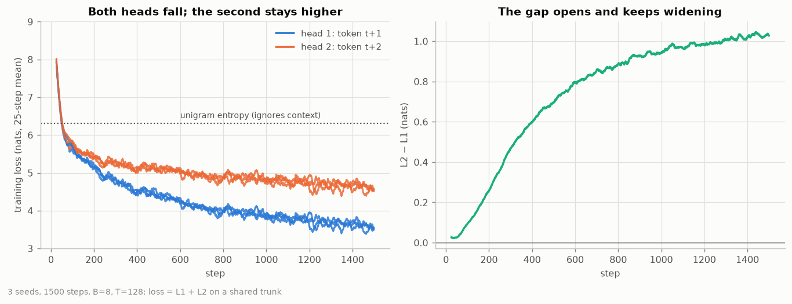

# Session 9: a loss harness that is correct and observable, and one extra head

**ERA V5 · Session 9 · Loss Functions & Output Heads**

The assignment's four lines (`hidden -> logits -> cross_entropy(logits[:, :-1], tokens[:, 1:])`) with every
implicit decision made explicit, printed and tested; then a second head predicting token `t+2`.

- **Notebook:** [`session9_loss_harness.ipynb`](session9_loss_harness.ipynb), executed top to bottom with
  outputs, 0 errors. It runs on Colab (the first cell clones this repo) or locally.
- **Code:** [`src/losses.py`](src/losses.py) is the harness (`align`, `loss_mask`, `lm_loss`,
  `chunked_cross_entropy`); [`experiments/`](experiments/) has one script per deliverable; the full
  write-up of each is in [`results/`](results/) (`e1..e8 .md/.json/.png`).
- **Setup:** 4-layer pre-norm/RMSNorm/SwiGLU GPT, `d_model` 256, 8.4M parameters, byte-level BPE from
  Session 2, vocabulary **V = 10,002** (10,000 + `<eos>` + `<pad>`), on a 1,361-article WikiText slice
  ([`data/`](data/)). Apple M4 (MPS), torch 2.13, fp32.

## Part 1: the seven numbers

| # | deliverable | result |
|---|---|---|
| 1 | Shapes | logits `[B, T, V]` = 4 x 128 x 10,002 is **39.1x** the hidden state `[B, T, D]` (= V/D). Every tensor and what each dimension is: [`results/e1_shapes.md`](results/e1_shapes.md) |
| 2 | Shift, as strings | Inputs beside targets, decoded: the target column is the input column moved up one row ([`e2_shift.md`](results/e2_shift.md)). Bugs trained 400 steps: **no shift** reports loss **0.19** but honest next-token loss is **12.76**; **reversed** reports **1.25** vs honest **9.16**; correct: 4.27 / 4.11. Both wrong shifts *look better* and learn a copy (97.9% / 79.2% copy rate). |
| 3 | Padding mask | Contributing tokens **1016 -> 455** (B=8, T=128, 55% padding). Dividing the masked sum by the wrong count gives 4.14 instead of 9.25. Trained with padding counted: reported loss 2.72 vs 4.57, yet worse on real tokens (4.954 vs 4.885); 49.5% of its probability sits on PAD. |
| 4 | Packing + boundary mask | Untrained: contributing pairs 1016 -> 1008, loss **9.2833 -> 9.2832** (invisible at step 0). After 400 steps, 2 docs/row: **4.4037 -> 4.3867**; at 16 docs/row 5.608 -> 5.485. The join pair is 1.5x harder (6.55 vs 4.39 nats) but only 0.8% of pairs at 2 docs, so it is diluted, not harmless. |
| 5 | Perplexity | Untrained perplexity **10,470** vs V = **10,002** (1.047x). Uniform logits give exactly ln V = 9.2105; the small excess is predicted by the logit spread (sigma^2/2). Also shown: this check catches the wrong denominator (perplexity 694) but **not** the wrong shift at step 0. |
| 6 | Tied vs untied | **8,400,128 vs 5,839,616** parameters: tying saves **2,560,512 (30.5%)**. On this run tied is 0.13 nats worse on held-out loss (4.236 vs 4.109), one pair of 400-step runs, not a verdict. |
| 7 | Peak memory | Ordinary **624.5 MiB** vs chunked (512 rows, recomputed in backward) **86.1 MiB** = **7.25x** lower, for forward + backward through the loss on 4,080 predictions (full logits = 155.7 MiB). Loss and gradients agree to float rounding. Full training step: 816 vs 434 MiB (1.88x). Measured by counting live tensors (`src/memory.py`) since MPS has no peak counter; a separate-process RSS check agrees on direction (3.15x). |

## Part 2: one extra head (`t+2`)

One trunk, two untied heads on the same hidden state, training loss `L1 + L2`. 1,500 steps, 3 seeds,
held-out loss (mean +/- std across seeds):

| | head 1 (`t+1`) | head 2 (`t+2`) | sum |
|---|---:|---:|---:|
| untrained | 9.244 | 9.252 | 18.496 |
| **trained** | **3.755 +/- 0.017** | **4.726 +/- 0.006** | **8.481 +/- 0.020** |

**What happens and why.**
- Both heads are identical for about the first 60 steps: both fall from ln V to the unigram entropy
  (6.31 nats), and token frequencies help `t+1` and `t+2` equally.
- Then they separate. Head 1 keeps improving; head 2 flattens. The gap L2 - L1 is about 0.6 nats at step 400,
  0.9 at step 800 and **0.97** at the end, still widening slowly.
- This is expected, not a bug: token `i+2` depends on the same context *and* on the unseen token `i+1`, so its
  uncertainty compounds. What head 1 learns from local structure is exactly what head 2 cannot use.
- The gap is a snapshot: at this size and length neither head is near its entropy floor.
- The second head costs head 1 a little: 3.755 vs 3.715 trained alone (+0.040, larger than the ~0.017 seed
  spread).
- The sum is dominated by the harder head and is not comparable to a single-head loss, so both are reported
  separately.

## Notes and limits

- Every result comes from the code in this folder, on the machine above; the notebook re-runs all of it
  (roughly 10+ minutes on the M4 plus the three-seed Part 2 runs; each script is also runnable on its own).
- Experiments 2-6 use one seed and 400 steps: they demonstrate the direction of each effect, not tight
  estimates. Part 2 uses three seeds.
- The peak-memory ratio depends on `B`, `T`, `V` and chunk size (sweep in [`e7_memory.md`](results/e7_memory.md):
  chunk 64 -> 16.7x, 2048 -> 2.4x). Chunking trades one extra `h @ W^T` per chunk in backward for memory.
- Only Parts 1 and 2 are covered, as in the assignment text provided.
